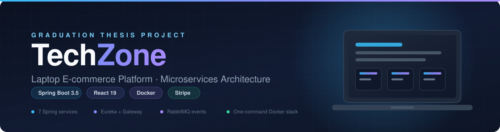
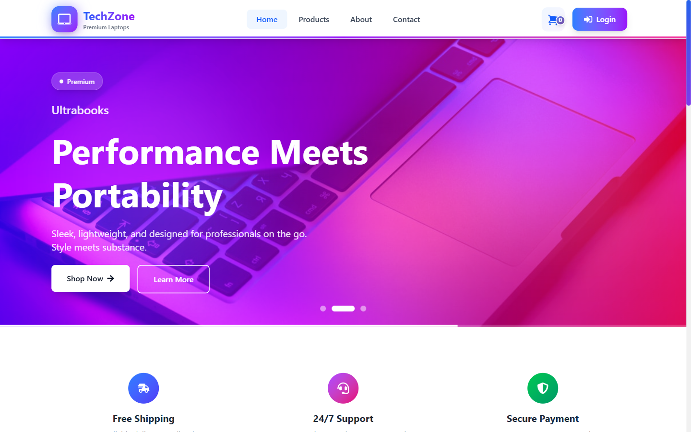
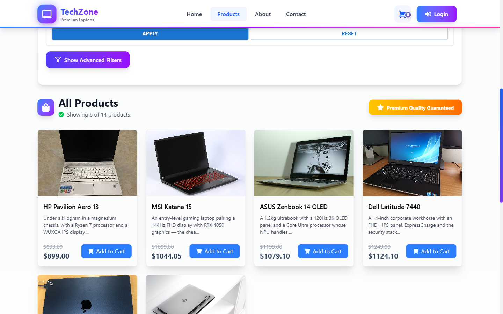
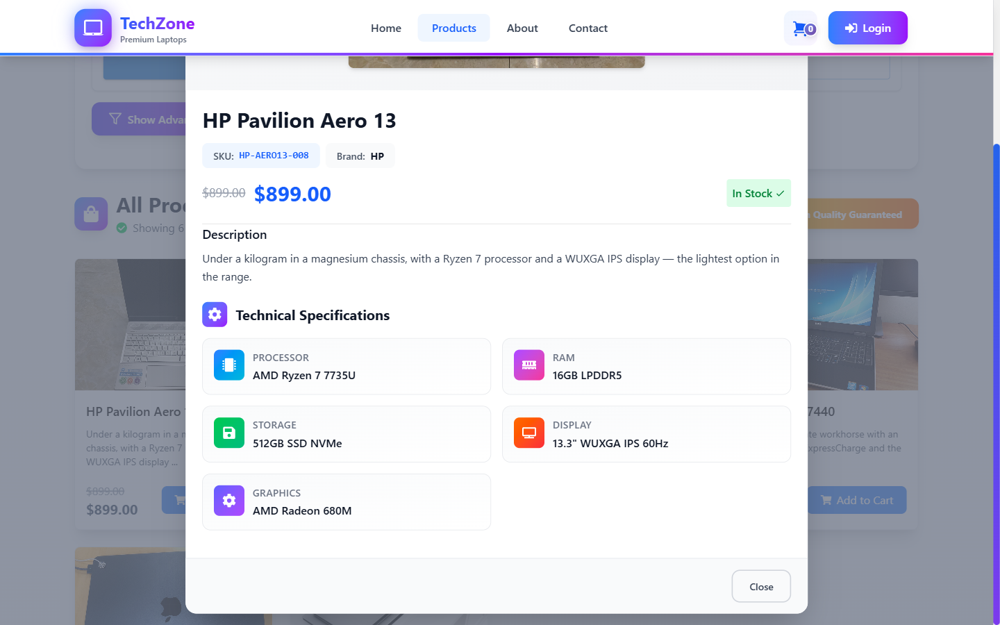
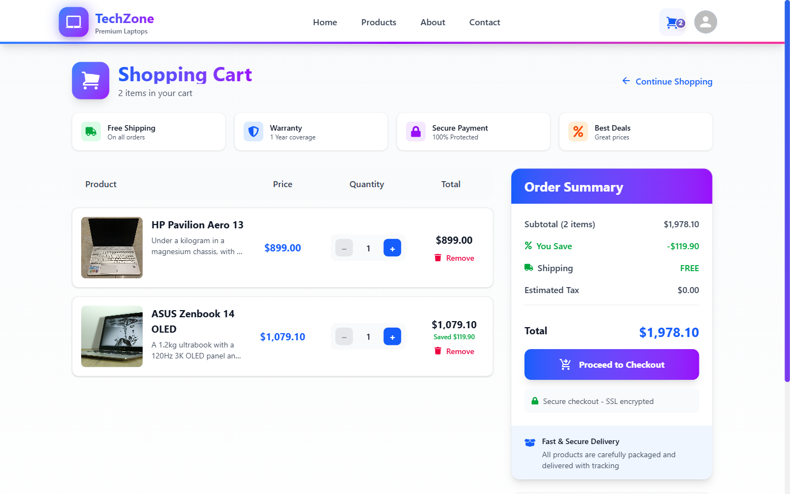
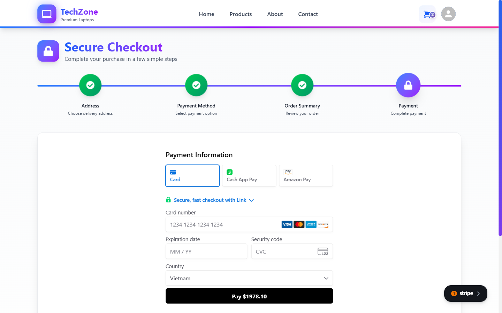
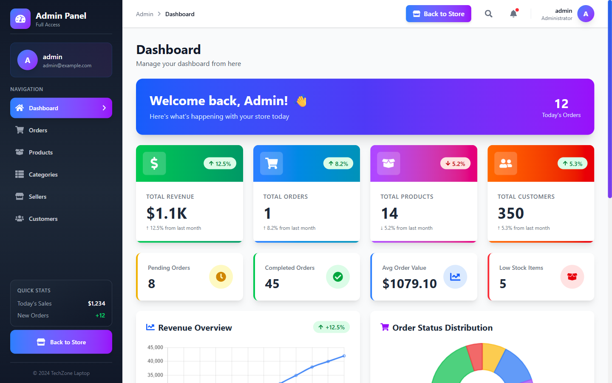
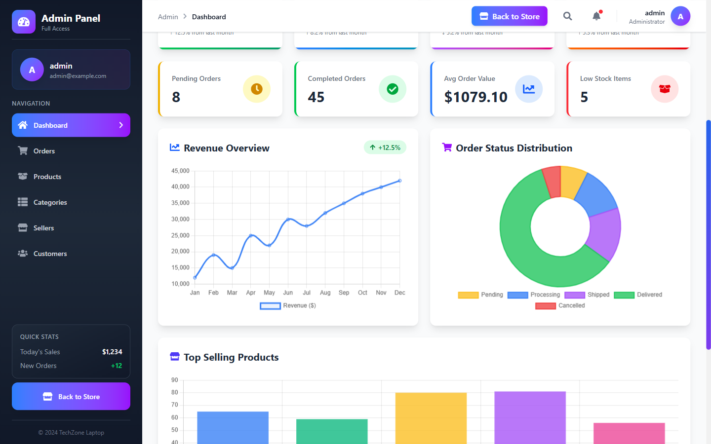
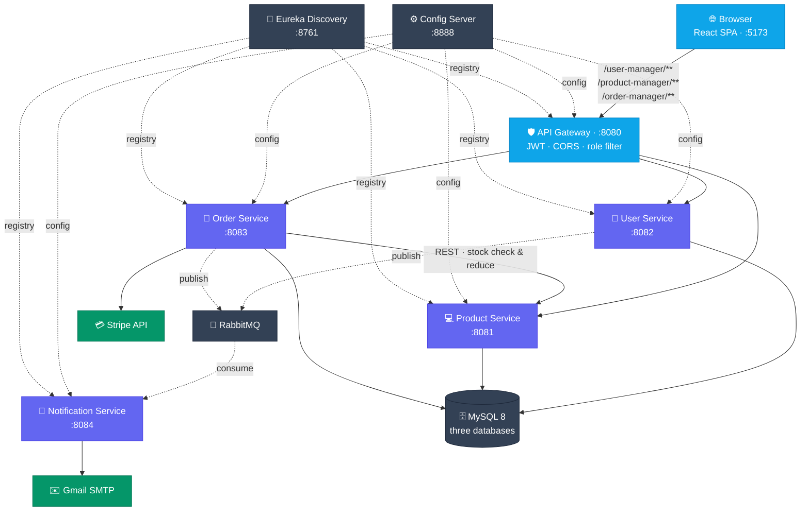

<div align="center">



<h1>💻 TechZone Laptop Project</h1>

<p><b>A production-shaped laptop e-commerce platform</b><br>
Spring Boot microservices behind a Spring Cloud Gateway, with a React 19 storefront —<br>
built for the graduation thesis <i>“Laptop E-commerce Platform Using Microservices Architecture”</i>.</p>

<p>
  <a href="#-quick-start"><b>Quick Start</b></a> ·
  <a href="#-screenshots"><b>Screenshots</b></a> ·
  <a href="#-architecture"><b>Architecture</b></a> ·
  <a href="#-tech-stack"><b>Tech Stack</b></a> ·
  <a href="docs/README.md"><b>Documentation</b></a> ·
  <a href="CHANGELOG.md"><b>Changelog</b></a>
</p>

<p>
  
  
  
  
  
</p>

</div>

---

## ✨ Highlights

| | Capability | Where it lives |
|:--:|---|---|
| 🧩 | **Seven Spring services** — gateway, config, discovery, user, product, order, notification | [`backend/`](backend) |
| 🔐 | **Cookie-based JWT auth** with three roles (Customer · Seller · Admin), enforced at the gateway | [security-model.md](docs/architecture/security-model.md) |
| 🛒 | **Catalog → cart → Stripe checkout**, with stock validated across a service boundary | [system-overview.md](docs/architecture/system-overview.md) |
| 📬 | **Asynchronous email** over RabbitMQ — registration and order confirmation | [notification-service.md](docs/backend/services/notification-service.md) |
| 📊 | **Admin dashboard** with Chart.js analytics, MUI DataGrid CRUD, and image upload | [frontend/overview.md](docs/frontend/overview.md) |
| 🐳 | **One command to run everything** — SPA and API served from a single origin | [docker-setup.md](docs/operations/docker-setup.md) |
| 📚 | **Documentation kept with the code** — ADRs, defect register, development log | [`docs/`](docs) |

---

## 🖼 Screenshots

<div align="center">
  
  <br><sub><b>Home</b> — Swiper banner carousel, feature strip, and featured products</sub>
</div>

<br>

<table>
  <tr>
    <td align="center" width="50%">
      <br>
      <b>🛍 Catalog</b><br><sub>Search, category and price-range filters, paged results</sub>
    </td>
    <td align="center" width="50%">
      <br>
      <b>💻 Product detail</b><br><sub>SKU, stock state and technical specifications</sub>
    </td>
  </tr>
  <tr>
    <td align="center" width="50%">
      <br>
      <b>🛒 Cart</b><br><sub>Quantity controls, discounts and running order summary</sub>
    </td>
    <td align="center" width="50%">
      <br>
      <b>💳 Checkout</b><br><sub>Four-step flow ending in Stripe Elements</sub>
    </td>
  </tr>
  <tr>
    <td align="center" width="50%">
      <br>
      <b>📊 Admin dashboard</b><br><sub>Revenue, orders, catalogue and customer KPIs</sub>
    </td>
    <td align="center" width="50%">
      <br>
      <b>📈 Analytics</b><br><sub>Chart.js line, doughnut and bar breakdowns</sub>
    </td>
  </tr>
</table>

---

## 🏗 Architecture



<details>
<summary><b>📋 Services and ports</b></summary>

<br>

| Service | Port | Responsibility | Database |
|---|:--:|---|---|
| 🌐 **Frontend** | `5173` | React SPA; in Docker, nginx also reverse-proxies API calls | — |
| 🛡 **API Gateway** | `8080` | Routing, JWT validation, CORS, role-based filtering | — |
| ⚙️ **Config Server** | `8888` | Centralized configuration (native profile, classpath) | — |
| 🧭 **Discovery Service** | `8761` | Eureka service registry | — |
| 👤 **User Service** | `8082` | Registration, BCrypt login, JWT issuance, addresses | `ecommerce` |
| 💻 **Product Service** | `8081` | Categories, products, specifications, images, filters | `ecommerce_product` |
| 🧾 **Order Service** | `8083` | Cart, order placement, Stripe payments, analytics | `ecommerce_order` |
| 📧 **Notification Service** | `8084` | RabbitMQ consumer → transactional email over SMTP | — |

Supporting infrastructure: **MySQL 8.0** (one container, one logical database per
service) and **RabbitMQ 3** (management UI on `15672`).

The frontend never addresses a service directly — the gateway strips the
`/{service}-manager` prefix and forwards to a Eureka-resolved instance, so no
host address is hardcoded anywhere.

</details>

<details>
<summary><b>🧠 Why it is built this way</b></summary>

<br>

Nine Architecture Decision Records cover the platform-level choices — each with
its context, the alternatives weighed, and the consequences accepted.

| # | Decision |
|:--:|---|
| 0001 | [Spring Cloud Gateway on WebFlux](docs/architecture/decisions/0001-spring-cloud-gateway-webflux.md) |
| 0002 | [Eureka for service discovery](docs/architecture/decisions/0002-eureka-service-discovery.md) |
| 0003 | [Shared HMAC JWT secret](docs/architecture/decisions/0003-shared-hmac-jwt-secret.md) |
| 0004 | [Cookie-based JWT](docs/architecture/decisions/0004-cookie-based-jwt.md) |
| 0005 | [RabbitMQ for notifications](docs/architecture/decisions/0005-rabbitmq-for-notifications.md) |
| 0006 | [Config Server native profile](docs/architecture/decisions/0006-config-server-native-profile.md) |
| 0007 | [Embedded product snapshot](docs/architecture/decisions/0007-embedded-product-snapshot.md) |
| 0008 | [Single MySQL, multiple databases](docs/architecture/decisions/0008-single-mysql-multiple-databases.md) |
| 0009 | [RestTemplate for service calls](docs/architecture/decisions/0009-resttemplate-for-service-calls.md) |

</details>

---

## 🧰 Tech Stack

<table>
<tr>
<td align="center" width="33%">

**⚙️ Backend**

<br>
<br>
<br>
<br>


</td>
<td align="center" width="33%">

**🎨 Frontend**

<br>
<br>
<br>
<br>


</td>
<td align="center" width="33%">

**🔌 Infrastructure**

<br>
<br>
<br>
<br>


</td>
</tr>
</table>

---

## 🚀 Quick Start

> **Prerequisites** — Docker with Compose **v2.20+** (the root file uses
> `include`), a Stripe **test** key pair, and a Gmail app password.

```bash
# 1 · clone with both submodules
git clone --recurse-submodules https://github.com/thaivanlam/Techzone-laptop-project.git
cd Techzone-laptop-project
#    already cloned?  →  git submodule update --init --recursive

# 2 · configure
cp .env.example .env      # fill in STRIPE_SECRET_KEY, MAIL_PASSWORD,
                          # and VITE_STRIPE_PUBLISHABLE_KEY

# 3 · launch the whole platform
docker compose up --build
```

Then open **<http://localhost:5173>**. The first build compiles seven Maven
projects and installs the npm dependencies, so expect several minutes — later
runs are cached.

A fresh stack starts with an empty shop. To load a demo catalogue of 14 laptops
across 4 categories, add the `seed` profile:

```bash
COMPOSE_PROFILES=prod,seed docker compose up -d
```

<details>
<summary><b>🔀 Three ways to run it</b></summary>

<br>

| Mode | What runs in Docker | Compose file | Use it when |
|---|---|---|---|
| **1 — Full stack** | Backend **and** frontend | [`docker-compose.yml`](docker-compose.yml) | Demoing, or a clean end-to-end check |
| **2 — Backend in Docker** | Backend only; the SPA on the Vite dev server | [`backend/docker-compose.yml`](backend/docker-compose.yml) | Working on the UI, with hot reload |
| **3 — Hybrid dev** | Infrastructure only; services run from the IDE | [`backend/docker-compose.yml`](backend/docker-compose.yml) | Debugging a service with breakpoints |

Do not run the root and the `backend/` Compose projects at the same time — they
share fixed container names and use separate MySQL volumes.

Full walkthrough: [docs/operations/running-locally.md](docs/operations/running-locally.md).

</details>

<details>
<summary><b>⚙️ Key environment variables</b></summary>

<br>

The root `.env` is the single configuration point — `docker-compose.yml` reads it
for the frontend and, through `include`, for every backend service.

| Variable | Default | Meaning |
|---|---|---|
| `SPRING_PROFILES_ACTIVE` | `prod` | Config Server profile. `dev` targets `localhost`, `prod` targets Docker hostnames |
| `COMPOSE_PROFILES` | `prod` | Which containers start. Empty ⇒ infrastructure only; add `seed` for the demo catalogue |
| `STRIPE_SECRET_KEY` | — | 🔑 Order Service payments |
| `MAIL_PASSWORD` | — | 🔑 Gmail app password for Notification Service |
| `VITE_STRIPE_PUBLISHABLE_KEY` | — | 🔑 Baked into the frontend bundle **at build time** |
| `FRONTEND_PORT` / `FRONTEND_URL` | `5173` / `http://localhost:5173` | Published port, CORS origin, Stripe return URL — keep the two in sync |
| `VITE_BACK_END_URL` | *(empty)* | Empty ⇒ same origin ⇒ nginx proxies to the gateway. **Build time** |
| `API_GATEWAY_URL` | `http://api-gateway:8080` | Where the frontend container forwards proxied calls. **Run time** |
| `MYSQL_PORT` | `3306` | Raise it (for example `3307`) when a native MySQL already holds 3306 |

The two profile variables must agree: `COMPOSE_PROFILES=prod` with
`SPRING_PROFILES_ACTIVE=dev` starts containers that look for `localhost` inside
their own network and fail.

Values marked **build time** are inlined into the bundle by Vite — after changing
one, run `docker compose build frontend && docker compose up -d frontend`.

`.env.example` carries placeholders only; real secrets never belong in the
repository.

</details>

<details>
<summary><b>🔗 Endpoints and demo accounts</b></summary>

<br>

| Surface | URL |
|---|---|
| 🛍 Storefront | <http://localhost:5173> |
| 🛡 API Gateway | <http://localhost:8080> |
| 🧭 Eureka dashboard | <http://localhost:8761> |
| 🐇 RabbitMQ management | <http://localhost:15672> |
| ⚙️ Config Server | <http://localhost:8888> |
| 📘 Swagger UI *(dev profile only)* | <http://localhost:8080/user-manager/swagger-ui.html> |

Demo accounts, created on first startup by each service's `CommandLineRunner`:

| Username | Email | Roles |
|---|---|---|
| `admin` | admin@example.com | 👑 ADMIN + SELLER + USER |
| `seller1` | seller1@example.com | 🏪 SELLER |
| `user1` · `user2` | user1@example.com · user2@example.com | 🛒 USER |

Their passwords are listed in
[docs/operations/running-locally.md](docs/operations/running-locally.md#seeded-users).
They are development defaults and must be changed before any public deployment.

</details>

---

## 🗂 Repository Layout

```
Techzone-laptop-project/
├── 📦 backend/               # submodule — Spring Boot 3.5 / Spring Cloud 2025
│   ├── api-gateway/          #   :8080  routing, JWT, CORS
│   ├── config-server/        #   :8888  centralized configuration
│   ├── discovery-service/    #   :8761  Eureka registry
│   ├── user-service/         #   :8082  identity, auth, addresses
│   ├── product-service/      #   :8081  catalog, specifications, images
│   ├── order-service/        #   :8083  cart, orders, Stripe
│   └── notification-service/ #   :8084  RabbitMQ → SMTP
├── 🎨 frontend/              # submodule — React 19 + Redux Toolkit + Tailwind v4
├── 📚 docs/                  # consolidated documentation for both submodules
├── 🐳 docker-compose.yml     # the full stack on one network
└── 📄 CHANGELOG.md           # user-visible changes, Keep a Changelog format
```

> ℹ️ `backend/` and `frontend/` are independent git repositories. This
> superproject records only their commit pointers — documentation edits belong
> in [`docs/`](docs) here.

---

## 📚 Documentation

Everything starts at **[`docs/README.md`](docs/README.md)**, which indexes the
full set and records the rules that keep it in step with the code.

| 🧭 | Area | Document |
|:--:|---|---|
| 🏗 | Services, ports, end-to-end request flow | [architecture/system-overview.md](docs/architecture/system-overview.md) |
| 🔐 | JWT issuance, cookie auth, role enforcement | [architecture/security-model.md](docs/architecture/security-model.md) |
| 🧠 | Platform decisions and trade-offs | [architecture/decisions/](docs/architecture/decisions/) |
| ⚙️ | Backend modules and conventions | [backend/overview.md](docs/backend/overview.md) |
| 🔌 | Every gateway-exposed endpoint | [backend/api-reference.md](docs/backend/api-reference.md) |
| 🐞 | Verified defect register | [backend/known-defects.md](docs/backend/known-defects.md) |
| 🧪 | The twelve defect classes found here | [quality/bug-taxonomy.md](docs/quality/bug-taxonomy.md) |
| 🎨 | Frontend stack, structure, and trade-offs | [frontend/overview.md](docs/frontend/overview.md) |
| 🚀 | Startup modes, environment variables, seeded users | [operations/running-locally.md](docs/operations/running-locally.md) |
| 🐳 | Compose topology, images, nginx proxy | [operations/docker-setup.md](docs/operations/docker-setup.md) |
| 🌱 | Database creation and catalogue seeding | [operations/database-seeding.md](docs/operations/database-seeding.md) |
| 📓 | How each change came about, session by session | [dev-log/](docs/dev-log/) |

---

## 🤝 Contributing

This is a thesis project, so the workflow is deliberately documentation-first.

1. **Read first.** Start from [`docs/README.md`](docs/README.md) and read what
   covers the area you are about to touch.
2. **Work in the right repository.** Code changes belong in the `backend/` or
   `frontend/` submodule; the superproject records the new pointer.
3. **Update the docs in the same change set.** Endpoints, config keys,
   environment variables, data model, flows, and trade-offs all count.
4. **Log the session.** Add an entry at the top of the current month's file in
   [`docs/dev-log/`](docs/dev-log) — naming secret variables, never their values,
   and never a live host's address.
5. **Record platform decisions as ADRs.** Copy
   [`template.md`](docs/architecture/decisions/template.md); accepted ADRs are
   immutable and are superseded, never rewritten.
6. **English only**, in every document, regardless of the language used in
   conversation or commits.

---

## 📄 License

Distributed under the **GNU Affero General Public License v3.0** — see
[LICENSE](LICENSE).

<div align="center">
<br>

**Copyright © 2025 Thái Văn Lâm**

<sub>Built as the graduation thesis <i>“Laptop E-commerce Platform Using Microservices Architecture”</i></sub>

</div>
