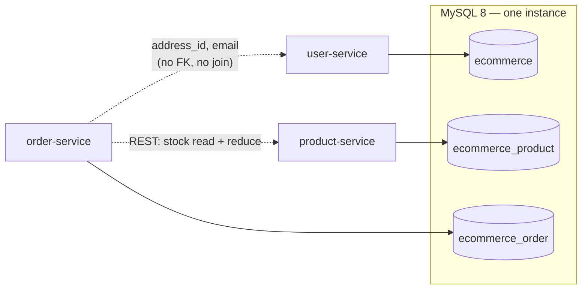
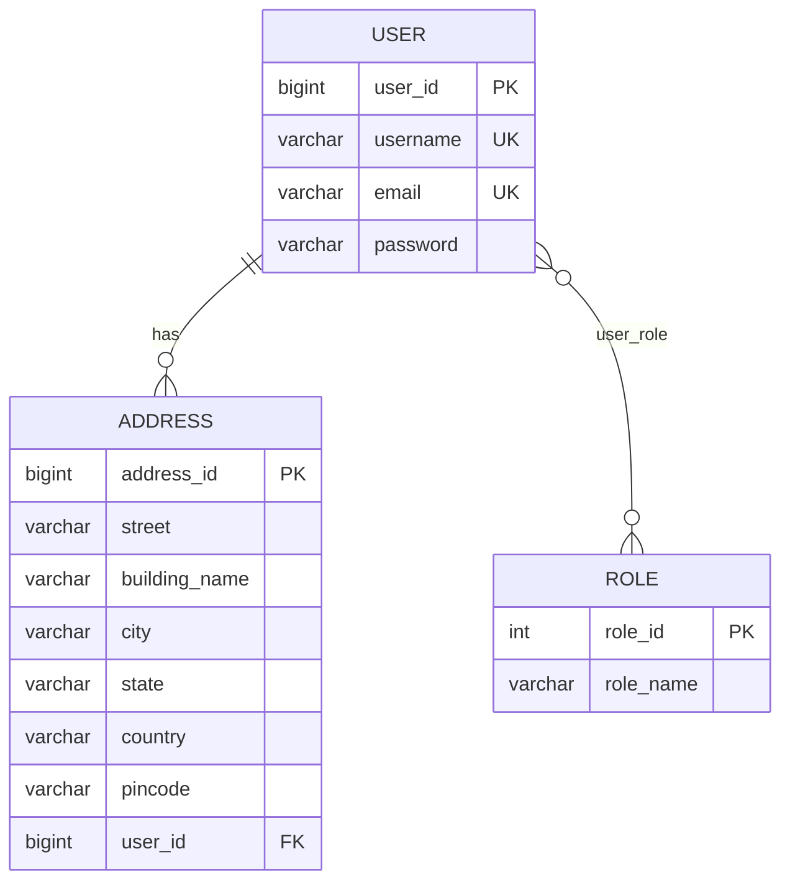
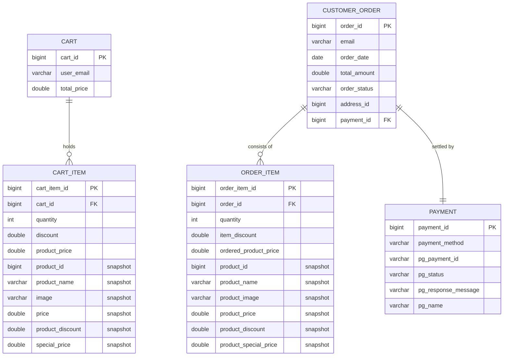

# Data Model

The physical schema of the platform: three logical databases, thirteen tables,
and the two mechanisms that carry data across the boundaries between them.

Schema is owned by Hibernate (`spring.jpa.hibernate.ddl-auto: update`), so the
authority for every column below is the entity class it is generated from. The
databases themselves are created by
[`backend/init-db/01-create-databases.sql`](../../backend/init-db/01-create-databases.sql).

Related documents: [system-overview.md](system-overview.md) ·
[uml-diagrams.md](uml-diagrams.md) ·
[decisions/0008-single-mysql-multiple-databases.md](decisions/0008-single-mysql-multiple-databases.md) ·
[decisions/0007-embedded-product-snapshot.md](decisions/0007-embedded-product-snapshot.md)

---

## Table of Contents

1. [Database Layout](#1-database-layout)
2. [`ecommerce` — Identity](#2-ecommerce--identity)
3. [`ecommerce_product` — Catalogue](#3-ecommerce_product--catalogue)
4. [`ecommerce_order` — Trade](#4-ecommerce_order--trade)
5. [Crossing the Database Boundary](#5-crossing-the-database-boundary)
6. [Identifier Generation](#6-identifier-generation)
7. [Constraints, Indexes and Types](#7-constraints-indexes-and-types)
8. [Data-Integrity Gaps](#8-data-integrity-gaps)
9. [Reference Data](#9-reference-data)

---

## 1. Database Layout

One MySQL 8 instance, three logical databases, one owner each. No service ever
issues a query against a database it does not own.

| Database | Owner | Tables | Character set |
|---|---|---|---|
| `ecommerce` | user-service | `user`, `role`, `user_role`, `address` | `utf8mb4` / `utf8mb4_unicode_ci` |
| `ecommerce_product` | product-service | `category`, `product`, `product_specifications`, `product_seq` | same |
| `ecommerce_order` | order-service | `cart`, `cart_item`, `customer_order`, `order_item`, `payment` | same |

Under the `dev` profile each service instead uses a schema of its own
(`laptop_ecommerce_graduation_project_user_service` and siblings); the table
structure is identical. See
[../operations/running-locally.md](../operations/running-locally.md#mode-3--hybrid-dev).



---

## 2. `ecommerce` — Identity

Source: [`backend/user-service/.../model/`](../../backend/user-service/src/main/java/com/ecommerce/user_service/model)



### `user`

| Column | Type | Null | Notes |
|---|---|---|---|
| `user_id` | `bigint` | no | PK, `AUTO_INCREMENT` |
| `username` | `varchar(20)` | no | unique constraint |
| `email` | `varchar(50)` | no | unique constraint, `@Email` validated |
| `password` | `varchar(120)` | no | BCrypt hash (60 characters); the plaintext is never stored |

### `role`

| Column | Type | Null | Notes |
|---|---|---|---|
| `role_id` | `int` | no | PK, `AUTO_INCREMENT` |
| `role_name` | `varchar(20)` | yes | `ROLE_USER`, `ROLE_SELLER`, `ROLE_ADMIN` — the `AppRole` enum stored as a string |

Three rows, inserted at first startup. Storing the enum by name rather than by
ordinal means a new role can be added anywhere in the enum without rewriting
existing rows.

### `user_role`

| Column | Type | Notes |
|---|---|---|
| `user_id` | `bigint` | FK → `user.user_id` |
| `role_id` | `int` | FK → `role.role_id` |

The many-to-many join. A user holding several roles has several rows here; the
seeded `admin` account has three.

### `address`

| Column | Type | Null | Notes |
|---|---|---|---|
| `address_id` | `bigint` | no | PK, `AUTO_INCREMENT` |
| `street` | `varchar(255)` | no | min 5 characters |
| `building_name` | `varchar(255)` | no | min 5 |
| `city` | `varchar(255)` | no | min 4 |
| `state` | `varchar(255)` | no | min 2 |
| `country` | `varchar(255)` | no | min 2 |
| `pincode` | `varchar(255)` | no | min 6 |
| `user_id` | `bigint` | yes | FK → `user.user_id` |

`user_id` is nullable at the database level even though every address created
through the API belongs to someone — the association is mapped from the `User`
side with `orphanRemoval = true`, so deleting a user deletes their addresses.

---

## 3. `ecommerce_product` — Catalogue

Source: [`backend/product-service/.../model/`](../../backend/product-service/src/main/java/com/ecommerce/product_service/model)

```mermaid
erDiagram
    CATEGORY ||--o{ PRODUCT : "contains"
    PRODUCT  ||--o| PRODUCT_SPECIFICATIONS : "described by"

    CATEGORY {
        bigint  category_id PK
        varchar category_name
    }
    PRODUCT {
        bigint  product_id PK
        varchar product_name
        varchar image
        varchar description
        int     quantity
        double  price
        double  discount
        double  special_price
        bigint  seller_id
        varchar seller_email
        bigint  category_id FK
        varchar sku
        varchar brand
    }
    PRODUCT_SPECIFICATIONS {
        bigint  id PK
        bigint  product_id FK_UK
        varchar processor
        varchar ram
        varchar storage
        varchar display
        varchar graphics
    }
```

### `category`

| Column | Type | Null | Notes |
|---|---|---|---|
| `category_id` | `bigint` | no | PK, `AUTO_INCREMENT` |
| `category_name` | `varchar(255)` | no | at least 5 characters; not unique at the database level |

### `product`

| Column | Type | Null | Notes |
|---|---|---|---|
| `product_id` | `bigint` | no | PK, allocated from `product_seq` — see [§6](#6-identifier-generation) |
| `product_name` | `varchar(255)` | no | at least 3 characters; uniqueness within a category is enforced in the service, not by a constraint |
| `image` | `varchar(255)` | yes | path relative to the served images directory — a bare file name for an upload (`<uuid>.jpg`), `seed/<slug>.jpg` for a seeded product, `default.png` for one created through the API; the URL is assembled at read time from `IMAGE_BASE_URL` |
| `description` | `varchar(255)` | no | at least 6 characters — 255 is short for prose, and the limit is not surfaced in the UI |
| `quantity` | `int` | yes | stock on hand |
| `price` | `double` | no | list price |
| `discount` | `double` | no | percentage, 0–100 |
| `special_price` | `double` | no | stored, not derived: `price - price * discount / 100` |
| `seller_id` | `bigint` | yes | `user.user_id` in the *other* database — no FK |
| `seller_email` | `varchar(255)` | yes | the value actually used for seller scoping |
| `category_id` | `bigint` | yes | FK → `category.category_id` |
| `sku` | `varchar(255)` | yes | `CATEGORY-BRAND-MODEL-RANDOM`, regenerated when name or brand changes |
| `brand` | `varchar(255)` | yes | free text; also the source of the brand facet |

Money is stored as `double`. That is wrong for currency and is recorded as a
trade-off in
[../backend/services/product-service.md](../backend/services/product-service.md#10-double-for-money);
the fix is `DECIMAL(12,2)` with `BigDecimal` in the entity.

### `product_specifications`

| Column | Type | Null | Notes |
|---|---|---|---|
| `id` | `bigint` | no | PK, `AUTO_INCREMENT` |
| `product_id` | `bigint` | yes | FK → `product.product_id`, unique — one specification per product |
| `processor` | `varchar(255)` | yes | e.g. `Intel Core i7-13700H` |
| `ram` | `varchar(255)` | yes | e.g. `16GB DDR5` |
| `storage` | `varchar(255)` | yes | e.g. `512GB SSD NVMe` |
| `display` | `varchar(255)` | yes | e.g. `15.6" FHD IPS 144Hz` |
| `graphics` | `varchar(255)` | yes | e.g. `NVIDIA RTX 4060 8GB` |

These five columns are what the faceted search filters on. They are free text
with a controlled vocabulary offered by the editor UI only — an off-vocabulary
value stores fine and then never matches a facet.

### `product_seq`

A Hibernate table generator, not business data: a single row holding
`next_val`. It exists because `Product` uses `GenerationType.AUTO`, which on
MySQL resolves to a table generator rather than to `AUTO_INCREMENT`. The
catalogue seeder writes explicit ids and must therefore raise `next_val`
afterwards, or the first product created through the UI collides. See
[../operations/database-seeding.md](../operations/database-seeding.md).

---

## 4. `ecommerce_order` — Trade

Source: [`backend/order-service/.../model/`](../../backend/order-service/src/main/java/com/ecommerce/order_service/model)



### `cart`

| Column | Type | Null | Notes |
|---|---|---|---|
| `cart_id` | `bigint` | no | PK, `AUTO_INCREMENT` |
| `user_email` | `varchar(255)` | no | the identity key; not unique at the database level although the service assumes one cart per email |
| `total_price` | `double` | yes | maintained incrementally, defaults to `0.0` |

### `cart_item`

| Column | Type | Notes |
|---|---|---|
| `cart_item_id` | `bigint` | PK |
| `cart_id` | `bigint` | FK → `cart.cart_id`; the cart cascades persist/merge/remove and removes orphans |
| `quantity` | `int` | units of this line |
| `discount` | `double` | discount applied to the line |
| `product_price` | `double` | unit price charged |
| *snapshot columns* | see below | embedded `ProductSnapshot` |

The embedded snapshot contributes `product_id`, `product_name`, `image`,
`description`, `price`, `product_discount`, `special_price`, `seller_id` and
`seller_email`. Only `discount` is renamed by an attribute override; the rest
take their field names.

### `customer_order`

| Column | Type | Null | Notes |
|---|---|---|---|
| `order_id` | `bigint` | no | PK, `AUTO_INCREMENT` |
| `email` | `varchar(255)` | no | the buyer, `@Email` validated; joins to `user.email` conceptually only |
| `order_date` | `date` | yes | day resolution — no time, so orders cannot be ordered within a day |
| `total_amount` | `double` | yes | the cart total at placement |
| `order_status` | `varchar(255)` | yes | free text; set to `Accepted` at placement |
| `address_id` | `bigint` | yes | `address.address_id` in the *other* database — no FK, and no copy of the address text |
| `payment_id` | `bigint` | yes | FK → `payment.payment_id` |

The table is named `customer_order` because `order` is a reserved word in SQL.

`address_id` is the weakest link in the model: the delivery address is stored by
reference across a service boundary, so an address the customer later edits or
deletes silently rewrites — or erases — where a historic order was shipped. The
same class of problem is precisely what `ProductSnapshot` exists to prevent for
products.

### `order_item`

| Column | Type | Notes |
|---|---|---|
| `order_item_id` | `bigint` | PK |
| `order_id` | `bigint` | FK → `customer_order.order_id` |
| `quantity` | `int` | units ordered |
| `item_discount` | `double` | discount applied to this line |
| `ordered_product_price` | `double` | unit price actually charged |
| *snapshot columns* | `product_id`, `product_name`, `product_image`, `product_price`, `product_discount`, `product_special_price`, plus `description`, `seller_id`, `seller_email` | embedded `ProductSnapshot` with explicit overrides |

Note that the same embeddable produces different column names in `cart_item`
and `order_item` (`image` versus `product_image`, `price` versus
`product_price`). The overrides were added on one side only.

### `payment`

| Column | Type | Notes |
|---|---|---|
| `payment_id` | `bigint` | PK |
| `payment_method` | `varchar(255)` | at least 4 characters, e.g. `stripe` |
| `pg_payment_id` | `varchar(255)` | the provider's transaction id |
| `pg_status` | `varchar(255)` | the provider's status, as reported by the browser |
| `pg_response_message` | `varchar(255)` | free-text provider message |
| `pg_name` | `varchar(255)` | provider name |

`Order` owns the association (`payment_id` lives on `customer_order`) while
`Payment` maps the inverse side — one row of each, created together.

---

## 5. Crossing the Database Boundary

Nothing joins across the three databases. Four references exist, and each is
carried differently.

| From | To | Carried as | Kept fresh by |
|---|---|---|---|
| `product.seller_id` / `seller_email` | `user` | plain columns, no FK | nothing — a deleted seller leaves products pointing at a ghost |
| `cart_item` / `order_item` → `product` | `product` | **embedded snapshot** of name, image, price, discount | deliberately *not* kept fresh — the snapshot is the historical record |
| `customer_order.address_id` | `address` | plain column, no FK | nothing — see the warning in [§4](#customer_order) |
| order placement → stock | `product.quantity` | synchronous REST call to `/api/internal/products/{id}/reduce-stock` | the call itself, with no transaction spanning both databases |

The snapshot is the one place where denormalisation is a decision rather than an
accident: [ADR-0007](decisions/0007-embedded-product-snapshot.md) explains why an
order line must not follow a foreign key to a mutable product row.

---

## 6. Identifier Generation

| Entity | Strategy | Effect on MySQL |
|---|---|---|
| `User`, `Role`, `Address` | `IDENTITY` | `AUTO_INCREMENT` |
| `Category`, `ProductSpecification` | `IDENTITY` | `AUTO_INCREMENT` |
| **`Product`** | **`AUTO`** | **table generator `product_seq`** |
| `Cart`, `CartItem`, `Order`, `OrderItem`, `Payment` | `IDENTITY` | `AUTO_INCREMENT` |

`Product` is the odd one out, and the inconsistency is load-bearing: any process
that inserts products directly — the catalogue seeder, a database restore, a
migration — must maintain `product_seq.next_val` by hand, while the same process
against `category` need do nothing. The verification step for this is documented
in [../operations/database-seeding.md](../operations/database-seeding.md).

---

## 7. Constraints, Indexes and Types

**What exists.** Primary keys everywhere; foreign keys inside each database;
unique constraints on `user.username` and `user.email`; a unique constraint on
`product_specifications.product_id`.

**What does not.**

| Missing | Consequence |
|---|---|
| Index on `product.category_id`, `product.seller_email`, `product.brand` | Every faceted query and every seller listing is a full scan beyond a few hundred rows |
| Index on `cart.user_email` | Cart lookup — the most frequent authenticated query — scans |
| Index on `customer_order.email` | Order history scans |
| Unique constraint on `cart.user_email` | Two carts for one buyer are possible; the service assumes they are not |
| Unique constraint on `(category_id, product_name)` | Duplicate-name prevention is service-side only, and races |
| `CHECK (quantity >= 0)` on `product` | Oversell is possible under concurrency (`BUG-02`) |
| `CHECK` or enum on `customer_order.order_status` | Any string is a status (`BUG-18`) |
| `DECIMAL` for money | `double` rounding on prices and totals |
| Time component on `order_date` | Orders within one day cannot be sequenced |

Column lengths come from Bean Validation: Hibernate applies `@Size(max = …)` to
generated DDL, which is why `user.username` is `varchar(20)` and
`user.password` is `varchar(120)` while unannotated string columns default to
`varchar(255)`.

---

## 8. Data-Integrity Gaps

Ordered by what they cost if they fire.

1. **Stock is not guarded by the database.** `quantity` is read, decremented and
   written by the application. Two concurrent checkouts read the same value
   (`BUG-02`); a multi-line order that fails half way leaves earlier lines'
   stock taken (`BUG-01`).
2. **Deleting a category deletes its products.** `Category.products` cascades
   `ALL`, so a category delete removes rows that carry order history's product
   ids (`BUG-13`).
3. **The delivery address is a dangling reference.** See [§4](#customer_order).
4. **Cart totals drift.** `cart.total_price` is maintained incrementally and can
   disagree with the sum of `cart_item` (`BUG-07`).
5. **Order status is unconstrained free text** (`BUG-18`).
6. **A deleted seller orphans products.** No FK, no cascade, no nulling.

Each of these has a register entry with a proposed fix in
[../backend/known-defects.md](../backend/known-defects.md).

---

## 9. Reference Data

Written at first startup by each service's `CommandLineRunner`, and by the
optional seeder.

| Data | Where from | Content |
|---|---|---|
| Roles | user-service startup | `ROLE_USER`, `ROLE_SELLER`, `ROLE_ADMIN` |
| Accounts | user-service startup | `admin`, `seller1`, `user1`, `user2` — credentials in [../operations/running-locally.md](../operations/running-locally.md#seeded-users) |
| Categories | `seed-db/catalogue.sql`, `seed` profile only | Gaming Laptops, Ultrabooks, Business Laptops, Creator Laptops |
| Products | same | 14 laptops with specifications, assigned to `seller1` |

A stack started without the `seed` profile has accounts and roles but an empty
catalogue.
