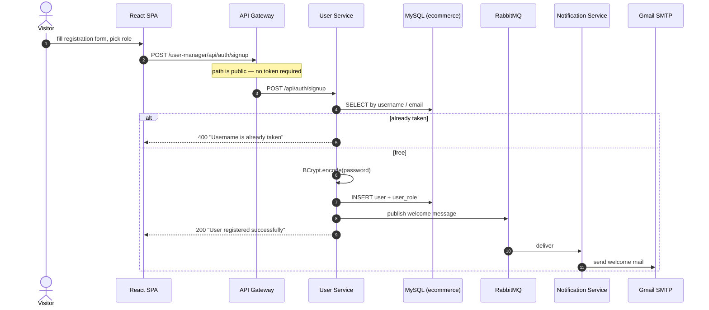
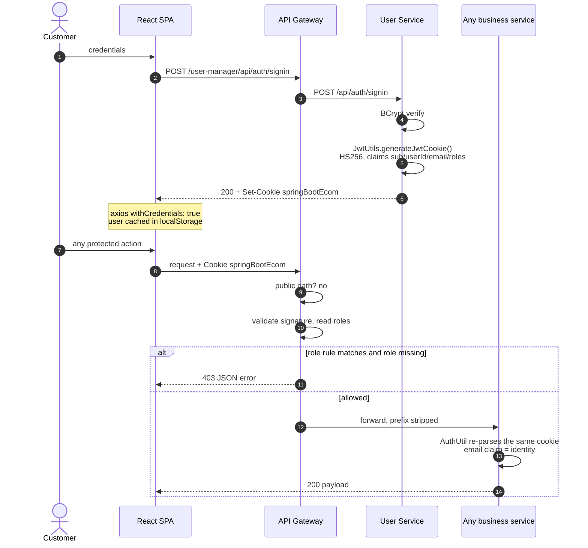
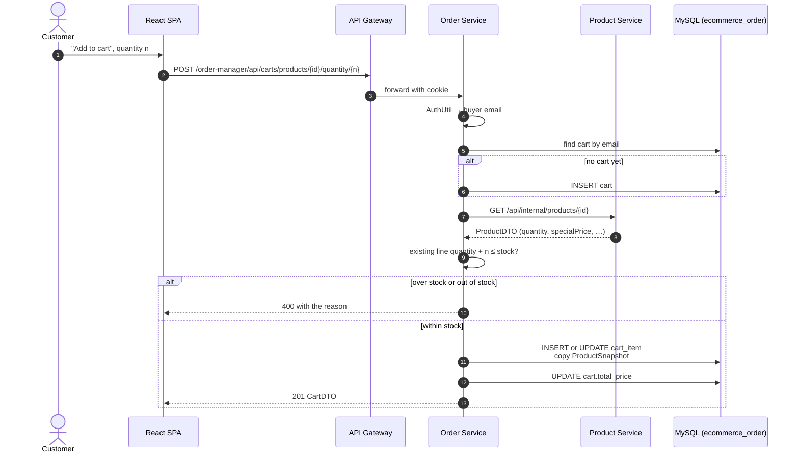
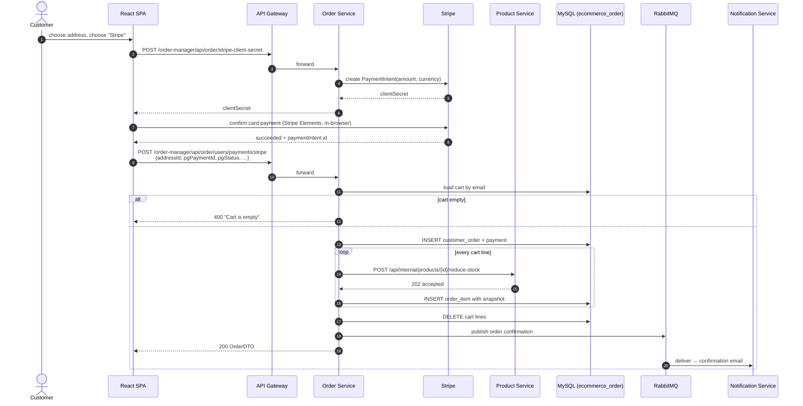
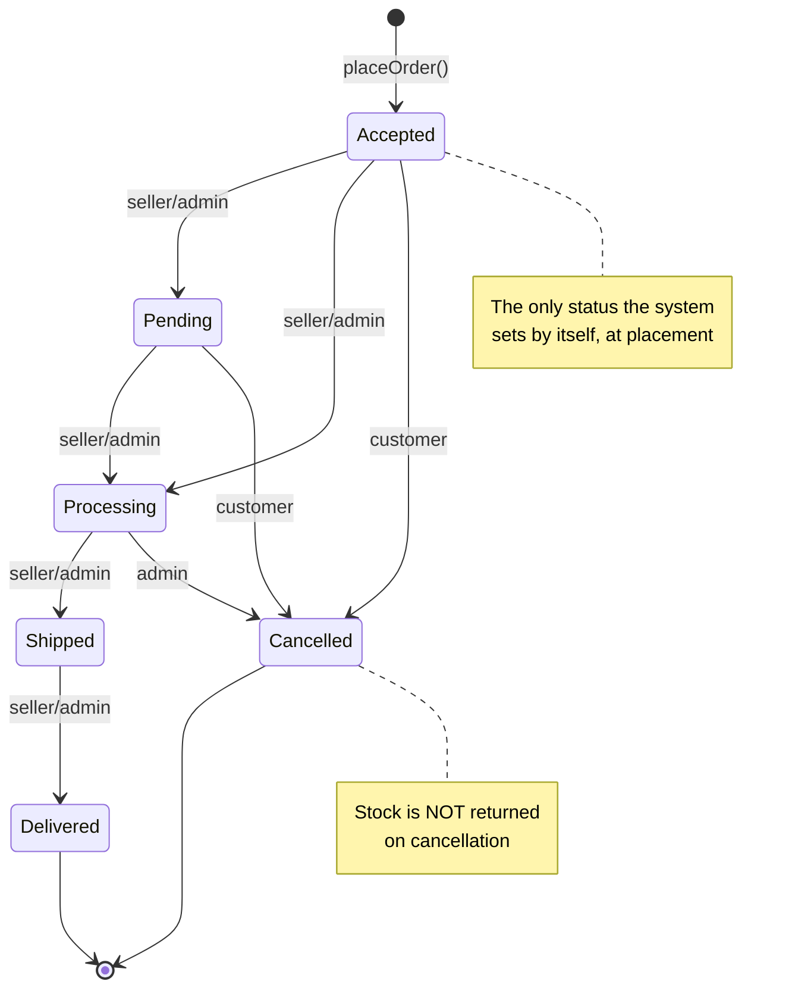
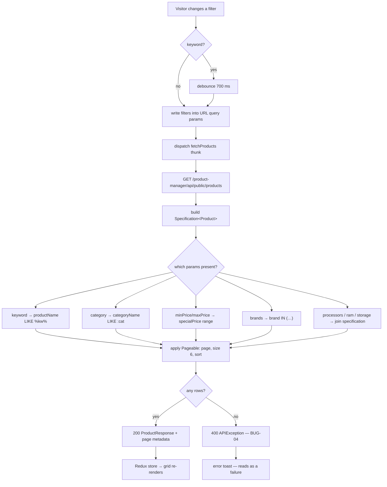

# UML — Behaviour Diagrams

How the platform behaves over time: four request journeys, the order lifecycle,
and the search flow.

Part of the diagram set indexed by [uml-diagrams.md](uml-diagrams.md) ·
Siblings: [uml-use-cases.md](uml-use-cases.md) ·
[uml-structure.md](uml-structure.md)

---

## Table of Contents

1. [Sequence — Registration](#1-sequence--registration)
2. [Sequence — Sign In and an Authenticated Call](#2-sequence--sign-in-and-an-authenticated-call)
3. [Sequence — Add to Cart](#3-sequence--add-to-cart)
4. [Sequence — Checkout and Payment](#4-sequence--checkout-and-payment)
5. [State Machine — Order](#5-state-machine--order)
6. [Activity — Faceted Product Search](#6-activity--faceted-product-search)

---

## 1. Sequence — Registration

Source: `AuthController.registerUser`, `RabbitMQProducer`,
`NotificationService`.

The role in step 2 is taken from the payload and granted as submitted — the
mechanism behind `SEC-01`.

---

## 2. Sequence — Sign In and an Authenticated Call

The token is validated **twice** — once at the gateway for access, once in the
service for identity — and no `SecurityContext` is built downstream. That is
what makes services stateless, and also what makes a missing gateway rule an
unauthenticated endpoint rather than merely an unauthorised one.

A forged signature does not travel this path cleanly: the validity check lets
`SignatureException` escape instead of returning false, so the gateway answers
`500` where `401` belongs (`BUG-19`).

---

## 3. Sequence — Add to Cart

Source: `CartServiceImpl.addProductToCart`, `ProductServiceClient`.

Every cart mutation costs one remote call per product touched — the N+1 pattern
recorded in
[../backend/services/order-service.md](../backend/services/order-service.md#7-n1-remote-calls-on-cart-operations).

Two defects live in the branch at step 10. Two simultaneous adds of the same
product both find no existing line and both insert one; with no unique
constraint on `cart_item (cart_id, product_id)` the cart is then permanently
unreadable (`BUG-21`). And a customer who has never had a cart at all gets a
`500` from the read path rather than an empty cart (`BUG-20`).

---

## 4. Sequence — Checkout and Payment

Source: `OrderController`, `OrderServiceImpl.placeOrder`, `StripeService`, and
`frontend/src/components/checkout/`.

Two weaknesses are visible in the arrows rather than in the code. The payment
outcome enters the system at step 9 **from the browser**, so the server records
what the client claims (`SEC-03`). And the stock loop has no compensating
action: a line that fails leaves the preceding lines' stock taken (`BUG-01`),
because no transaction spans two databases.

The loop is also where the oversell race lives — two checkouts reading the same
stock figure before either writes (`BUG-02`).

---

## 5. State Machine — Order

The statuses the UI offers. The backend stores whatever string it is given
(`BUG-18`), so this is the *intended* machine, not an enforced one.

Two gaps worth stating plainly: no transition returns stock to the catalogue, so
a cancelled order's units stay consumed; and nothing prevents `Delivered →
Pending`, or any other reversal, because there is no transition table anywhere —
the sets in `UpdateOrderForm.jsx` and `CustomerOrders.jsx` are dropdown
contents, not rules.

Making this machine real means a `CHECK` constraint or an enum on
`customer_order.order_status` plus a transition guard in
`OrderServiceImpl.updateOrder` — see
[data-model.md](data-model.md#7-constraints-indexes-and-types).

---

## 6. Activity — Faceted Product Search

Source: `useProductFilter.js`, `ProductServiceImpl.searchProducts`, and the
`Specification<Product>` builder.

The specification joins at step M are inner joins, which is why a product with
no specification row disappears from any technical facet (`BUG-14`). The
category predicate at step J is a `LIKE` with no wildcards, which makes it an
exact match with the cost of a pattern scan (`BUG-15`). And the branch at step O
turns the ordinary case of "nothing matched" into an error (`BUG-04`) — the one
defect on this path that every visitor eventually sees.
