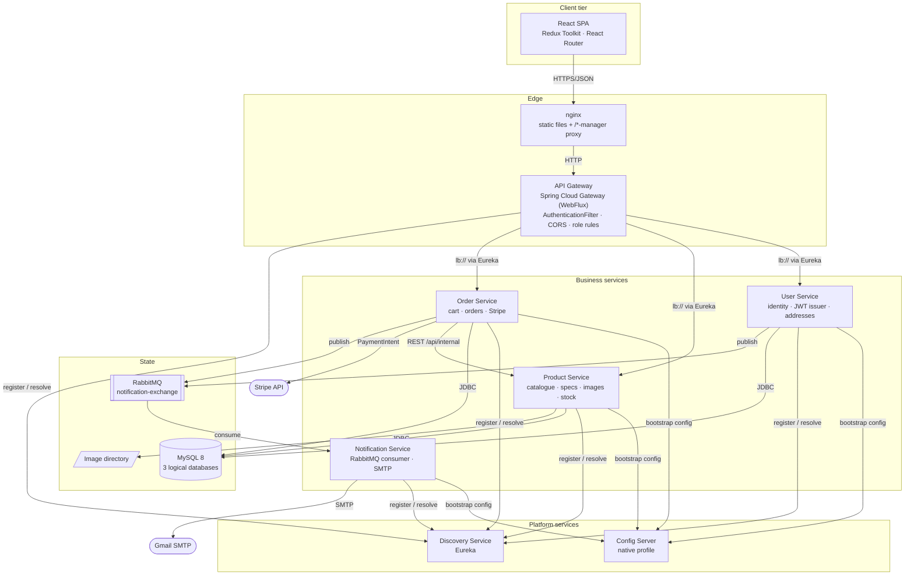
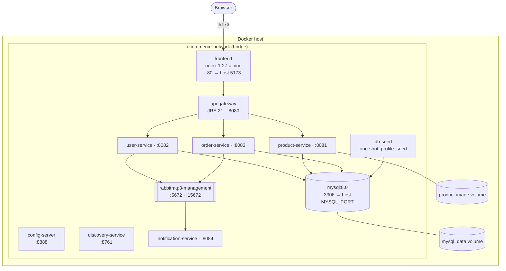
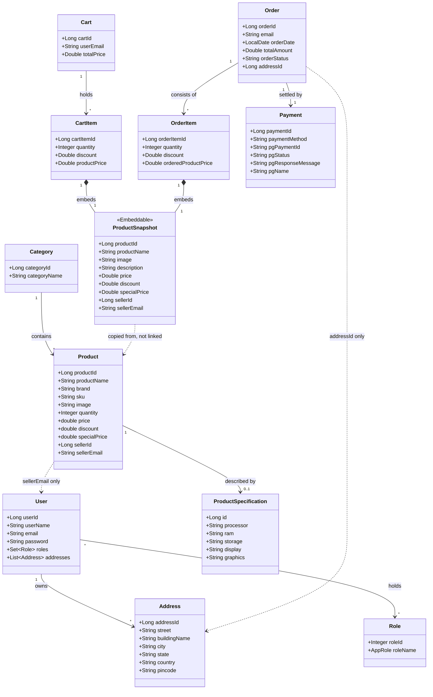
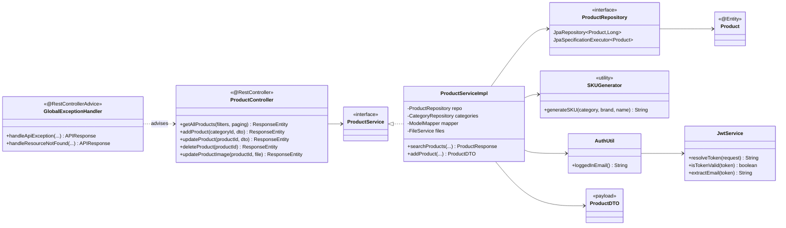

# UML — Structure Diagrams

What the platform is made of: components and their connections, how they are
deployed, and the classes behind both.

Part of the diagram set indexed by [uml-diagrams.md](uml-diagrams.md) ·
Siblings: [uml-use-cases.md](uml-use-cases.md) ·
[uml-behaviour.md](uml-behaviour.md)

---

## Table of Contents

1. [Component Diagram](#1-component-diagram)
2. [Deployment Diagram](#2-deployment-diagram)
3. [Domain Class Diagram](#3-domain-class-diagram)
4. [Backend Layering Class Diagram](#4-backend-layering-class-diagram)

---

## 1. Component Diagram

What talks to what, and over which protocol.

Two things the diagram makes visible that prose hides: **Notification Service is
not behind the gateway** — it is reached only through the broker, or directly on
its port — and **Order Service is the only service that calls another
synchronously**, which is why it is the only one whose availability depends on
another's.

### Connector inventory

| From | To | Protocol | Synchronous | Failure behaviour |
|---|---|---|---|---|
| SPA | nginx / gateway | HTTP + cookie | yes | Surfaced to the user |
| Gateway | business services | HTTP via `lb://` | yes | `503` if unregistered |
| Order Service | Product Service | HTTP `RestTemplate` | yes | **Propagates — no circuit breaker** |
| Order Service | Stripe | HTTPS | yes | Checkout fails |
| User / Order Service | RabbitMQ | AMQP publish | no | Publish sits inside the order transaction (`BUG-11`) |
| RabbitMQ | Notification Service | AMQP consume | no | A failed send is swallowed (`BUG-06`) |
| Services | Config Server | HTTP, at boot | yes | Service exits at startup |
| Services | Eureka | HTTP, periodic | no | Stale registry until the lease expires |

---

## 2. Deployment Diagram

The full-Docker topology from [`docker-compose.yml`](../../docker-compose.yml).
Ports shown are host ports; inside `ecommerce-network` every container is
addressed by service name.

Start-up ordering is enforced by Compose health checks, not by retry loops:
config-server and discovery-service must report healthy before a business
service starts, and the gateway waits for the services it routes to. See
[../operations/docker-setup.md](../operations/docker-setup.md).

Every service is drawn as one instance because one is what runs. Nothing in the
design prevents more — identity travels in the token, so there is no session
affinity — except the stock race described in
[uml-behaviour.md](uml-behaviour.md#4-sequence--checkout-and-payment).

---

## 3. Domain Class Diagram

The persistent domain, across all three services. Dashed links cross a database
boundary and are therefore **not** foreign keys.

The three dashed relations are the whole cross-service story of the model. Two
of them are plain ids that can dangle; the third — `ProductSnapshot` — is a
deliberate copy, and is the reason an order's line items keep their prices when
a seller re-prices the product. See
[decisions/0007-embedded-product-snapshot.md](decisions/0007-embedded-product-snapshot.md).

The physical schema these classes generate — columns, types, constraints and the
gaps in them — is in [data-model.md](data-model.md).

---

## 4. Backend Layering Class Diagram

Every business service is built the same way. Product Service is drawn; User and
Order Service differ only in the names.

The convention is stated once in
[../backend/overview.md](../backend/overview.md#shared-conventions):
`controller → service → repository → model`, DTOs in `payload`, errors funnelled
through a `@RestControllerAdvice`.

Identity is **not** a Spring Security concern downstream — each service parses
the cookie itself through its own `AuthUtil`, and no `SecurityContext` is built.
That is what makes the services stateless, and also why a missing gateway rule
produces an *unauthenticated* endpoint rather than merely an unauthorised one.
The working rules for staying inside this structure are in
[../development/developer-guide.md](../development/developer-guide.md#4-backend-conventions).
