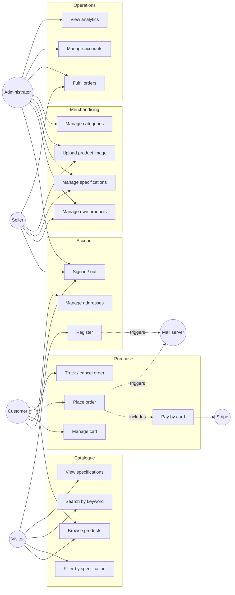

# UML — Use Case Diagrams

Who uses the platform, and what for.

Part of the diagram set indexed by [uml-diagrams.md](uml-diagrams.md) ·
Siblings: [uml-structure.md](uml-structure.md) ·
[uml-behaviour.md](uml-behaviour.md)

Derived from the endpoint access levels in
[../backend/api-reference.md](../backend/api-reference.md) and the route guards
in `frontend/src/App.jsx`.

---

## Actors

| Actor | Role held | Reaches the system through |
|---|---|---|
| **Visitor** | none | The public catalogue |
| **Customer** | `ROLE_USER` | The shop, signed in |
| **Seller** | `ROLE_SELLER` | The management panel, scoped to their own products |
| **Administrator** | `ROLE_ADMIN` | The management panel, unrestricted |
| **Stripe** | — | Called outward for payment |
| **Mail server** | — | Called outward for transactional email |

Roles are cumulative in practice rather than by inheritance: an account may hold
several, and the seeded `admin` account holds all three. See
[security-model.md](security-model.md#role-hierarchy).

---

## The Diagram

---

## Use Cases and the Requirements They Serve

| Use case | Requirement | Primary actor |
|---|---|---|
| Browse products | FR-SRCH-6, FR-CAT-2 | Visitor |
| Filter by specification | FR-SRCH-2 … FR-SRCH-5 | Visitor |
| Search by keyword | FR-SRCH-1, FR-SRCH-7 | Visitor |
| View specifications | FR-SPC-3 | Visitor |
| Register | FR-AUTH-1, FR-AUTH-2, FR-AUTH-8 | Visitor |
| Sign in / out | FR-AUTH-3 … FR-AUTH-5, FR-AUTH-7 | Customer |
| Manage addresses | FR-ADR-1 … FR-ADR-5 | Customer |
| Manage cart | FR-CART-1 … FR-CART-10 | Customer |
| Place order | FR-ORD-1 … FR-ORD-4 | Customer |
| Pay by card | FR-PAY-1 … FR-PAY-4 | Customer |
| Track / cancel order | FR-ORD-5, FR-ORD-6 | Customer |
| Manage own products | FR-PRD-1 … FR-PRD-10 | Seller |
| Manage specifications | FR-SPC-1, FR-SPC-2, FR-SPC-4, FR-SPC-5 | Seller |
| Upload product image | FR-PRD-7 | Seller |
| Manage categories | FR-CAT-1 | Administrator |
| Fulfil orders | FR-ORD-7, FR-ORD-8, FR-ORD-9 | Seller, Administrator |
| Manage accounts | FR-USR-1 … FR-USR-5 | Administrator |
| View analytics | FR-ANL-1 … FR-ANL-3 | Administrator |

Requirement text is in [../requirements/srs.md](../requirements/srs.md); the same
ground as user stories is in
[../requirements/user-stories.md](../requirements/user-stories.md).

---

## Intended Access Versus Actual Access

The diagram shows access **as designed**. Four cases are currently reachable by
actors that should not have them:

| Use case | Reachable by | Defect |
|---|---|---|
| Manage accounts | Anyone, signed in or not | `SEC-02` |
| Track / cancel order — on *someone else's* order | Any signed-in user | `SEC-08` |
| Manage addresses — on *someone else's* address | Any signed-in user | `SEC-09` |
| Manage own products — on *another seller's* product | Any seller | `SEC-05` |

Registration is a fifth case with the opposite problem: it grants whichever role
the caller asks for, so a Visitor can become an Administrator in one request
(`SEC-01`).

Actual reachability is documented in
[security-model.md](security-model.md#enforcement-gaps-worth-knowing); the
defects themselves are in
[../backend/known-defects.md](../backend/known-defects.md).
