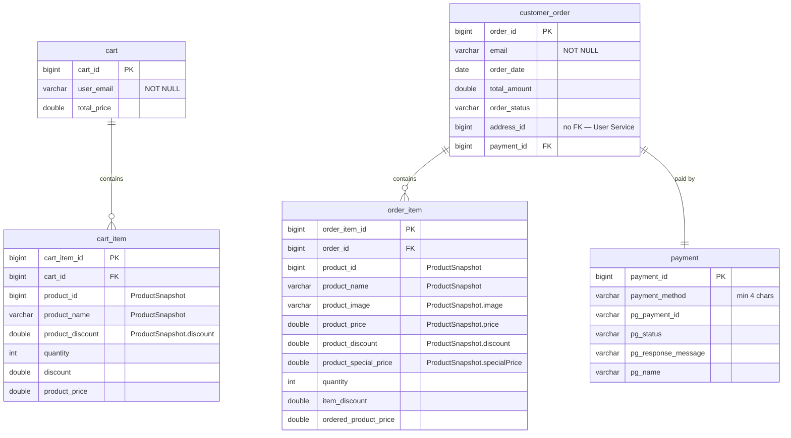

# Order Service — Architecture Documentation

**Module:** `backend/order-service`
**Port:** `8083` · **Gateway prefix:** `/order-manager/**`
**Database:** `ecommerce_order` (prod) / `laptop_ecommerce_graduation_project_order_service` (dev)
**Stack:** Spring Boot 3.5.7 · Spring Data JPA · Spring AMQP · Stripe Java 30.0.0 · Java 21

---

## Table of Contents

1. [Service Overview](#1-service-overview)
2. [System Context](#2-system-context)
3. [Internal Layered Architecture](#3-internal-layered-architecture)
4. [Data Model](#4-data-model)
5. [REST API Reference](#5-rest-api-reference)
6. [Cart Lifecycle](#6-cart-lifecycle)
7. [Order Placement Flow](#7-order-placement-flow)
8. [Stripe Payment Integration](#8-stripe-payment-integration)
9. [Async Integration — RabbitMQ](#9-async-integration--rabbitmq)
10. [Authentication & Authorization](#10-authentication--authorization)
11. [Configuration](#11-configuration)
12. [Exception Handling](#12-exception-handling)
13. [Deployment & Dependencies](#13-deployment--dependencies)
14. [Design Notes & Known Trade-offs](#14-design-notes--known-trade-offs)
15. [Cross-References](#15-cross-references)

---

## 1. Service Overview

Order Service owns everything from "add to cart" through "order delivered". It
is the most behaviourally complex service in the backend and the only one that
talks to a third-party API.

### Responsibilities

| Responsibility | Entry point |
|---|---|
| Cart CRUD, per authenticated user | `CartController` |
| Bulk cart replacement (guest-cart merge on login) | `POST /api/cart/create` |
| Order placement, converting cart to order | `OrderController.orderProducts` |
| Stripe `PaymentIntent` creation | `OrderController.createStripeClientSecret` |
| Order listing for customer, seller, and admin | `OrderController` |
| Order status transitions | three `PUT .../status` endpoints |
| Platform revenue and order-count aggregates | `AnalyticsService` |
| Stock validation and reduction | `ProductServiceClient` → Product Service |
| Order confirmation email | `NotificationPublisher` → RabbitMQ |

### What it does not own

- **Products.** Only `productId` plus an embedded `ProductSnapshot` copy.
- **Addresses.** `Order.addressId` is a bare `Long` pointing into User Service's
  `address` table. Order Service never dereferences it; the frontend joins the
  two. `AddressDTO` exists only as part of the Stripe request payload.
- **Users.** Carts and orders key on the email string from the JWT.

---

## 2. System Context

```
                    Browser (React SPA)
                            │
                            ▼
                   API Gateway :8080
                   /order-manager/**
                            │
                            ▼
        ┌───────────────────────────────────────┐
        │ Order Service :8083                   │
        │   CartController / OrderController    │
        │   AuthUtil ← re-parses the JWT cookie │
        └──┬──────────────┬──────────────┬──────┘
           │              │              │
   RestTemplate       RabbitMQ        Stripe API
           │              │              │
           ▼              ▼              ▼
   Product Service   notification-  api.stripe.com
   :8081/api/         exchange
   internal/**            │
                          ▼
                notification-service :8084
                          │
                          ▼
                    MySQL ecommerce_order
```

### External Dependencies

| Dependency | Purpose | Failure behaviour |
|---|---|---|
| Product Service `/api/internal/**` | Fetch product, reduce stock | `RestTemplate` throws; surfaces as an unhandled 500. No circuit breaker, no fallback |
| MySQL | Persistence | Startup fails |
| RabbitMQ | Order confirmation email | `convertAndSend` throws inside the order transaction |
| Stripe API | `PaymentIntent` creation | `StripeException` propagates out of the controller |
| Config Server | All configuration | `optional:` import — startup continues without a datasource, then fails |
| Discovery Service | Registers as `ORDER-SERVICE` | Gateway route unavailable until registered |

Note that Product Service is reached at a **configured base URL**
(`product.service.base-url`), not through `lb://` or through the gateway. Eureka
plays no part in this call.

---

## 3. Internal Layered Architecture

```
com.ecommerce.order_service
├── OrderServiceApplication.java
├── client/
│   ├── ProductServiceClient.java              # interface: getProductById, reduceProductQuantity
│   └── RestTemplateProductServiceClient.java  # RestTemplate implementation
├── clientpayload/
│   └── ProductDTO.java                        # Product Service's response shape
├── config/
│   ├── AppConfig.java                         # ModelMapper + RestTemplate beans
│   ├── AppConstants.java                      # pagination defaults
│   ├── RabbitMQConfig.java                    # JSON converter + RabbitTemplate
│   ├── SwaggerConfig.java                     # OpenAPI metadata + bearer scheme
│   └── WebMvcConfig.java                      # /images/** → file:images/
├── controller/            CartController, OrderController
├── exceptions/            APIException, EmptyArrayException,
│                          ResourceNotFoundException, MyGlobalExceptionHandler
├── model/                 Cart, CartItem, Order, OrderItem, Payment, ProductSnapshot
├── payload/               DTOs (see §5)
├── repositories/          Cart, CartItem, Order, OrderItem, Payment
├── security/JwtService.java                   # cookie → claims
├── service/               Cart, Order, Analytics, Stripe (+Impl), NotificationPublisher
└── util/AuthUtil.java                         # request-scoped claims cache
```

### Layer responsibilities

| Layer | Rule |
|---|---|
| `controller` | HTTP binding and status codes only; resolves the caller's email via `AuthUtil` |
| `service` | All business rules, transactions, DTO mapping, remote calls |
| `repositories` | Spring Data JPA; three custom JPQL queries plus derived methods |
| `model` | JPA entities; `ProductSnapshot` is `@Embeddable`, not an entity |
| `client` | The only place Product Service is called |

`SwaggerConfig` advertises a **bearer** security scheme even though the service
authenticates by cookie. Swagger's "Authorize" button therefore does not produce
a working request — paste the cookie into the browser instead.

`WebMvcConfig` maps `/images/**` to a local `images/` directory. Order Service
never writes images; this handler is copied from Product Service and serves
nothing.

---

## 4. Data Model

### Entity-relationship diagram



Schema is generated by Hibernate (`ddl-auto: update`); there are no migrations.

### `ProductSnapshot` — the cross-service boundary

`ProductSnapshot` is `@Embeddable` and inlined into both `cart_item` and
`order_item`. It captures product state at the moment the item was added:

```java
Long   productId;    String productName;  String image;
String description;  Double price;        Double discount;
Double specialPrice; Long   sellerId;     String sellerEmail;
```

Order Service holds **no foreign key** to Product Service. A later price change,
rename, or product deletion leaves historical orders intact. The rationale is in
[../../architecture/decisions/0007-embedded-product-snapshot.md](../../architecture/decisions/0007-embedded-product-snapshot.md).

The two embeddings use different `@AttributeOverrides`, so the column names
differ between the tables:

| Snapshot field | `cart_item` column | `order_item` column |
|---|---|---|
| `productId` | `product_id` | `product_id` |
| `productName` | `product_name` | `product_name` |
| `image` | `image` | `product_image` |
| `price` | `price` | `product_price` |
| `discount` | `product_discount` | `product_discount` |
| `specialPrice` | `special_price` | `product_special_price` |

`sellerEmail` inside the snapshot is what seller order filtering keys on
([§5](#orders-and-payments--ordercontroller-api)).

### Relationships and cascade rules

| Relationship | Cascade | Orphan removal |
|---|---|---|
| `Cart` → `CartItem` | `PERSIST, MERGE, REMOVE` | `true` |
| `Order` → `OrderItem` | `PERSIST, MERGE` | no |
| `Order` ↔ `Payment` | `PERSIST` (owning side `Order.payment_id`) | no |

`Order` → `OrderItem` deliberately omits `REMOVE`: deleting an order would leave
orphaned items rather than silently destroying order history. Nothing deletes
orders today.

### Repository queries

| Repository | Method | Query |
|---|---|---|
| `CartRepository` | `findCartByEmail` | `SELECT c FROM Cart c WHERE c.userEmail = ?1` |
| | `findCartByEmailAndCartId` | email + id |
| | `findCartsByProductId` | `JOIN FETCH c.cartItems ci WHERE ci.productSnapshot.productId = ?1` |
| `CartItemRepository` | `findCartItemByProductIdAndCartId` | by cart id + snapshot product id |
| | `deleteCartItemByProductIdAndCartId` | `@Modifying` delete |
| | `deleteAllByCartId` | `@Modifying` delete |
| `OrderRepository` | `getTotalRevenue` | `SELECT COALESCE(SUM(o.totalAmount), 0) FROM Order o` |
| | `findByEmailIgnoreCase` | derived, paginated |

`findCartsByProductId` is unused; `PaymentRepository` and `OrderItemRepository`
are plain `JpaRepository`s.

---

## 5. REST API Reference

Paths below are service-local. Prepend `/order-manager` for the gateway URL.

### Cart — `CartController` (`/api`)

| Method | Path | Success | Access at gateway |
|---|---|---|---|
| POST | `/cart/create` | 201 | authenticated |
| POST | `/carts/products/{productId}/quantity/{quantity}` | 201 | authenticated |
| GET | `/carts` | **302 FOUND** | authenticated |
| GET | `/carts/users/cart` | 200 | authenticated |
| PUT | `/cart/products/{productId}/quantity/{operation}` | 200 | authenticated |
| DELETE | `/carts/{cartId}/product/{productId}` | 200 | authenticated |

- `{operation}` is a string: `delete` decrements by 1, anything else increments
  by 1. There is no way to set an absolute quantity through this endpoint.
- `GET /carts` returns **every cart in the system** and is only authenticated,
  not role-checked — see [§14](#14-design-notes--known-trade-offs).
- `GET /carts` returning `302 FOUND` is a mis-chosen status code; the body is a
  normal JSON array and there is no `Location` header.

### Orders and Payments — `OrderController` (`/api`)

| Method | Path | Success | Access at gateway |
|---|---|---|---|
| POST | `/order/users/payments/{paymentMethod}` | 201 | authenticated |
| POST | `/order/stripe-client-secret` | 201 | authenticated |
| GET | `/order/users/orders` | 200 | authenticated (own orders) |
| PUT | `/order/users/orders/{orderId}/status` | 200 | authenticated |
| GET | `/admin/orders` | 200 | `ROLE_ADMIN` |
| PUT | `/admin/orders/{orderId}/status` | 200 | `ROLE_ADMIN` |
| GET | `/admin/app/analytics` | 200 | `ROLE_ADMIN` |
| GET | `/seller/orders` | 200 | `ROLE_ADMIN` or `ROLE_SELLER` |
| PUT | `/seller/orders/{orderId}/status` | 200 | `ROLE_ADMIN` or `ROLE_SELLER` |

All three `PUT .../status` endpoints call the identical
`orderService.updateOrder(orderId, status)` — they differ only in the gateway
role required to reach them.

### Pagination

`AppConstants` supplies the defaults for `/admin/orders`, `/seller/orders`, and
`/order/users/orders`:

| Param | Default |
|---|---|
| `pageNumber` | `0` |
| `pageSize` | `3` |
| `sortBy` | `totalAmount` |
| `sortOrder` | `asc` |

A default page size of 3 and a default sort by amount (not date) are unusual for
an order list; the frontend overrides both.

### DTOs

| DTO | Fields |
|---|---|
| `CartDTO` | `cartId`, `totalPrice`, `products: ProductDTO[]` |
| `CartItemDTO` | `productId`, `quantity` |
| `OrderRequestDTO` | `addressId`, `paymentMethod`, `pgName`, `pgPaymentId`, `pgStatus`, `pgResponseMessage` |
| `OrderDTO` | `orderId`, `email`, `orderItems`, `orderDate`, `payment`, `totalAmount`, `orderStatus`, `addressId` |
| `OrderItemDTO` | `orderItemId`, `product: ProductDTO`, `quantity`, `discount`, `orderedProductPrice` |
| `OrderResponse` | `content`, `pageNumber`, `pageSize`, `totalElements`, `totalPages`, `lastPage` |
| `OrderStatusUpdateDto` | `status` |
| `PaymentDTO` | `paymentId`, `paymentMethod`, `pgPaymentId`, `pgStatus`, `pgResponseMessage`, `pgName` |
| `StripePaymentDto` | `amount`, `currency`, `email`, `name`, `address: AddressDTO`, `description`, `metadata` |
| `AnalyticsOrderResponse` | `totalRevenue`, `totalOrders` — both **strings** |
| `APIResponse` | `message`, `status` — error envelope |

`CartDTO.products` is a list of `ProductDTO`, where `quantity` carries the
**cart line quantity**, not the product's available stock. The same class is used
for both meanings.

`OrderRequestDTO.paymentMethod` is ignored — the controller takes the method
from the path variable instead.

---

## 6. Cart Lifecycle

A cart is created lazily on first write and keyed by `user_email` from the JWT.
There is exactly one cart per email; nothing enforces this at the database level.

### `addProductToCart(productId, quantity)`

```
1. createCart()          → find by email, or insert a new empty cart
2. productServiceClient.getProductById(productId)
3. existing line for this product?
     yes → validateInventory(product, quantity, existing.quantity)
           existing.quantity += quantity; refresh price/discount/snapshot
     no  → validateInventory(product, quantity, 0)
           new CartItem with a fresh snapshot
4. cart.totalPrice = Σ (line.productPrice × line.quantity)     ← full recompute
5. save cart, return CartDTO
```

`validateInventory` rejects the request when the product's `quantity` is null or
≤ 0, or when `existing + requested` exceeds available stock.

### `updateProductQuantityInCart(productId, delta)`

Called with `+1` or `-1` from the controller.

```
newQuantity = line.quantity + delta
newQuantity < 0   → APIException("The resulting quantity cannot be negative.")
newQuantity == 0  → deleteProductFromCart(...) and return
delta > 0         → validateInventory(product, delta, line.quantity)
cart.totalPrice += line.productPrice × delta                   ← incremental
```

### `deleteProductFromCart(cartId, productId)`

```
cart.totalPrice -= line.productPrice × line.quantity           ← incremental
delete the cart_item row
```

The cart is not explicitly saved; the `@Transactional` dirty check flushes it.

### `createOrUpdateCartWithItems(List<CartItemDTO>)`

Full replacement, used when a guest cart is merged on login:

```
find cart by email, or create
delete every existing cart_item for that cart
for each incoming item:
   fetch product, validateInventory(product, quantity, 0)
   insert a new CartItem with a fresh snapshot
cart.totalPrice = Σ (price × quantity)
```

One `getProductById` call per line — an N+1 remote call pattern.

### Total-price drift

`addProductToCart` and `createOrUpdateCartWithItems` **recompute** the total from
the line items; `updateProductQuantityInCart` and `deleteProductFromCart` apply
an **incremental delta**. If a product's `specialPrice` changes in Product
Service between two operations, the incremental path subtracts a different
amount than was added, and `cart.total_price` drifts away from the sum of its
lines. The next full recompute silently corrects it.

---

## 7. Order Placement Flow

`OrderServiceImpl.placeOrder` is annotated `@Transactional`
(`jakarta.transaction.Transactional`).

```
POST /order-manager/api/order/users/payments/{paymentMethod}
Body: OrderRequestDTO { addressId, pgName, pgPaymentId, pgStatus, pgResponseMessage }

 1. email ← AuthUtil.loggedInEmail()        (from the JWT cookie)
 2. cart  ← cartRepository.findCartByEmail(email)
       null    → 404 ResourceNotFoundException
       empty   → 400 APIException("Cart is empty")
 3. Order:  email, orderDate = LocalDate.now(), totalAmount = cart.totalPrice,
            orderStatus = "Accepted", addressId
 4. Payment: paymentMethod (path variable) + the four pg* fields from the body
            linked both ways, cascaded on save
 5. orderRepository.save(order)
 6. for each cart line → OrderItem carrying the SAME ProductSnapshot instance,
            quantity, discount, orderedProductPrice = line.productPrice
    orderItemRepository.saveAll(...)
 7. for each cart line:
       productServiceClient.reduceProductQuantity(productId, quantity)   ← remote
       cartService.deleteProductFromCart(cartId, productId)
 8. map to OrderDTO
 9. notificationPublisher.sendEmailNotification(EmailDetails{...})       ← remote
10. return 201 with OrderDTO
```

### What is not checked at step 7

Stock was validated when the item entered the cart, possibly days earlier. It is
**not** re-validated at placement. Product Service's `reduceProductQuantity`
does check and throws `APIException("Insufficient product quantity")` — but by
then the order row already exists and earlier lines have already been decremented.

The local transaction rolls the order back; the remote decrements do not roll
back. A multi-line order that fails on its third line leaves the first two
products permanently short in the catalogue with no order to account for them.
This is the classic distributed-transaction gap, and the fix is a saga with
compensating actions or an outbox — see [§14](#14-design-notes--known-trade-offs).

### Seller order listing

`getAllSellerOrders` filters by the seller's email against
`orderItem.productSnapshot.sellerEmail`:

```java
orderRepository.findAll(sortByAndOrder)   // every order, sorted, in memory
    .stream().filter(o -> o.getOrderItems().stream()
        .anyMatch(i -> sellerEmail.equalsIgnoreCase(i.getProductSnapshot().getSellerEmail())))
    .toList();
// then subList(fromIndex, toIndex) for manual pagination
```

A `Pageable` is constructed and never used. Every order in the database is
loaded into heap on every call. This is listed as a known limitation in
[../../architecture/system-overview.md](../../architecture/system-overview.md#known-limitations).

### Order status

`orderStatus` is a free-form `String`, initialised to `"Accepted"`. There is no
enum, no state machine, and no validation — `updateOrder` writes whatever string
arrives. A typo becomes a new status silently.

---

## 8. Stripe Payment Integration

### Flow

```
Browser                    Order Service                 Stripe
   │  POST /order-manager/api/order/stripe-client-secret
   │  { amount, currency, email, name, address, description }
   ├──────────────────────────►│
   │                           │  Customer.search(email:'…')
   │                           ├──────────────────────────►│
   │                           │  not found → Customer.create(name, email, address)
   │                           │  PaymentIntent.create(amount, currency,
   │                           │      customer, description,
   │                           │      automaticPaymentMethods.enabled = true)
   │                           │◄──────────────────────────┤
   │◄──────────────────────────┤  201, body = clientSecret (plain text)
   │
   │  Stripe.js confirms the payment in the browser
   │
   │  POST /order-manager/api/order/users/payments/{paymentMethod}
   │  { addressId, pgName, pgPaymentId, pgStatus, pgResponseMessage }
   ├──────────────────────────►│  order created, payment row written
```

`StripeServiceImpl` sets the static `Stripe.apiKey` in a `@PostConstruct` block
from `${stripe.secret.key}`, which has **no default** — the context fails to
start if `STRIPE_SECRET_KEY` is unset.

The response body of `/order-stripe-client-secret` is the raw client secret as
`text/plain`, not JSON.

### The trust gap

There is **no Stripe webhook endpoint**. Order Service learns whether payment
succeeded only from the `pgStatus` field the browser sends in step 2. A client
can post `pgStatus: "succeeded"` with a fabricated `pgPaymentId` and never pay;
the order is created, stock is decremented, and a confirmation email goes out.

The correct design is a `payment_intent.succeeded` webhook that Stripe calls
server-to-server, with the order confirmed only when the intent's status is
verified against Stripe's API.

`StripeException` from the controller is not handled by
`MyGlobalExceptionHandler`, so a Stripe failure surfaces as a Spring Boot default
500 with a whitelabel body rather than an `APIResponse`.

---

## 9. Async Integration — RabbitMQ

### Publisher

```java
@Service
public class NotificationPublisher {
    private final RabbitTemplate rabbitTemplate;
    @Value("${queue.notification.exchange}")   private String notificationExchange;
    @Value("${queue.notification.routing-key}") private String notificationRoutingKey;

    public void sendEmailNotification(EmailDetails emailDetails) {
        rabbitTemplate.convertAndSend(notificationExchange, notificationRoutingKey, emailDetails);
    }
}
```

`RabbitMQConfig` registers a `Jackson2JsonMessageConverter` and a `RabbitTemplate`
that uses it. Order Service declares **no queue, exchange, or binding** — it
publishes to an exchange that Notification Service creates.

### Configuration

| Key | Value | Where |
|---|---|---|
| `queue.notification.exchange` | `notification-exchange` | local `application.yaml` |
| `queue.notification.routing-key` | `notification-routing-key` | local `application.yaml` |
| `spring.rabbitmq.host` | `localhost` / `rabbitmq` | Config Server, per profile |

Credentials are unset, so `guest`/`guest` on port 5672 is used.

### Message payload

```json
{
  "recipient": "customer@example.com",
  "subject": "Order Confirmation - Order 42",
  "msgBody": "Thank you for your purchase! Your order 42 has been placed successfully with total amount 1299.0."
}
```

`com.ecommerce.order_service.payload.EmailDetails` and
`vn.vti.dtn2504.notificationservice.payload.EmailDetails` are unrelated classes
with matching field names; the JSON converter bridges them.

### Publishing inside the transaction

`sendEmailNotification` is called at the end of `placeOrder`, inside the
`@Transactional` boundary and after the remote stock reductions. If RabbitMQ is
unreachable, `convertAndSend` throws, the order transaction rolls back — but the
stock decrements do not. Publishing after commit (or through an outbox table)
would decouple the two.

---

## 10. Authentication & Authorization

Order Service has **no Spring Security** on the classpath. Identity comes from
re-parsing the same cookie the gateway already validated.

### `JwtService` (`security/`)

| Method | Behaviour |
|---|---|
| `resolveToken(HttpServletRequest)` | First cookie named `springBootEcom` with a non-blank value |
| `isTokenValid(token)` | `parseClaims` in a try/catch over the four jjwt exception types |
| `parseClaims(token)` | HMAC verification with `Keys.hmacShaKeyFor(BASE64.decode(jwtSecret))` |
| `extractEmail(claims)` | `claims.get("email")` |
| `extractUsername(claims)` | `claims.getSubject()` |
| `extractRoles(claims)` | List or comma-separated string |

Unlike Product Service's otherwise identical `JwtService`, this one has **no**
`extractUserId` — Order Service never needs the numeric user id.

### `AuthUtil`

`loggedInEmail()` returns the `email` claim, falling back to the token subject,
and throws `APIException("Missing authenticated user email")` if neither is
present. Parsed claims are cached on the `HttpServletRequest` under the attribute
`ORDER_SERVICE_JWT_CLAIMS`, so a request that resolves the caller more than once
parses the token only once.

`extractRoles` is never called in this service. **All role enforcement happens at
the gateway** — nothing in Order Service checks who the caller is beyond their
email.

### Consequences

| Endpoint | Enforced by | Ownership check |
|---|---|---|
| `GET /order/users/orders` | email from JWT | yes — `findByEmailIgnoreCase(email)` |
| `PUT /order/users/orders/{orderId}/status` | authenticated only | **no** — any user can set any order's status |
| `DELETE /carts/{cartId}/product/{productId}` | authenticated only | **no** — `cartId` comes from the path, not the token |
| `GET /carts` | authenticated only | **no** — returns all carts of all users |
| `GET /seller/orders` | gateway role check | filters by the caller's email |
| `PUT /seller/orders/{orderId}/status` | gateway role check | **no** — any seller can change any order |

---

## 11. Configuration

### Local — `order-service/src/main/resources/application.yaml`

```yaml
spring:
  application: { name: order-service }
  profiles:    { active: ${SPRING_PROFILES_ACTIVE:dev} }
  config:      { import: optional:configserver:${CONFIG_SERVER_URL:http://localhost:8888} }

queue:
  notification:
    exchange: notification-exchange
    routing-key: notification-routing-key
```

### From Config Server — `config/order-service.yml`

| Key | Value |
|---|---|
| `spring.jpa.hibernate.ddl-auto` | `update` |
| `spring.app.jwtSecret` | shared HMAC secret |
| `spring.app.jwtExpirationMs` | `3000000` |
| `spring.ecom.app.jwtCookieName` | `springBootEcom` |
| `server.port` | `8083` |
| `stripe.secret.key` | `${STRIPE_SECRET_KEY}` — **required, no default** |
| `springdoc.api-docs.enabled` | `true` |

### Profile overrides

| Key | `-dev` | `-prod` |
|---|---|---|
| `spring.datasource.url` | `jdbc:mysql://localhost:3306/laptop_ecommerce_graduation_project_order_service?serverTimezone=UTC&createDatabaseIfNotExist=true` | `jdbc:mysql://mysql:3306/ecommerce_order?createDatabaseIfNotExist=true` |
| `spring.datasource.username` / `password` | `root` / `root` | `root` / `root` |
| `spring.rabbitmq.host` | `localhost` | `rabbitmq` |
| `product.service.base-url` | `http://localhost:8081/api` | `http://product-service:8081/api` |
| `frontend.url` | `http://localhost:5173` | `${FRONTEND_URL:...}` |
| Eureka zone | `http://localhost:8761/eureka/` | `http://discovery-service:8761/eureka/` |
| `springdoc.api-docs.enabled` | inherits `true` | `false` |

### Environment variables

| Variable | Default | Effect if unset |
|---|---|---|
| `STRIPE_SECRET_KEY` | none | Context fails at `@PostConstruct` |
| `SPRING_PROFILES_ACTIVE` | `dev` | Targets `localhost` MySQL/RabbitMQ |
| `CONFIG_SERVER_URL` | `http://localhost:8888` | No datasource → startup failure |
| `FRONTEND_URL` | `http://localhost:5173` | Declared but unused in code |

---

## 12. Exception Handling

`MyGlobalExceptionHandler` (`@RestControllerAdvice`):

| Exception | Status | Body |
|---|---|---|
| `MethodArgumentNotValidException` | 400 | `{ "<field>": "<message>" }` map |
| `ResourceNotFoundException` | 404 | `APIResponse{ message, status:false }` |
| `APIException` | 400 | `APIResponse{ message, status:false }` |

`ResourceNotFoundException` formats its message as
`"%s not found with %s: %s"` (or `%d` for the `Long` overload).

### Not handled

| Exception | Result |
|---|---|
| `StripeException` | Spring Boot default 500 |
| `RestClientException` from Product Service | Default 500 |
| `AmqpException` from RabbitMQ | Default 500, order rolled back |
| `EmptyArrayException` | Declared but never thrown or mapped |

So every cross-service failure surfaces as an untyped 500 with no `APIResponse`
envelope, which the frontend cannot distinguish from a bug.

---

## 13. Deployment & Dependencies

### Docker

Multi-stage build on `mcr.microsoft.com/openjdk/jdk:21-ubuntu`, exposing `8083`.

Under the `prod` compose profile it depends on `mysql`, `rabbitmq`,
`discovery-service`, `config-server`, and `api-gateway` being healthy, and
receives `SPRING_PROFILES_ACTIVE`, `SPRING_CONFIG_IMPORT`, `CONFIG_SERVER_URL`,
`STRIPE_SECRET_KEY`, and `FRONTEND_URL`.

### Maven dependencies

| Dependency | Version | Why |
|---|---|---|
| `spring-boot-starter-data-jpa` | 3.5.7 | Persistence |
| `spring-boot-starter-web` | 3.5.7 | REST |
| `spring-boot-starter-validation` | 3.5.7 | `@Email`, `@NotBlank`, `@Size` on entities |
| `spring-boot-starter-amqp` | 3.5.7 | RabbitMQ publishing |
| `spring-cloud-starter-config` | 2025.0.0 | Config Server client |
| `spring-cloud-starter-netflix-eureka-client` | 2025.0.0 | Registers as `ORDER-SERVICE` |
| `stripe-java` | 30.0.0 | `PaymentIntent`, `Customer` |
| `modelmapper` | 3.2.4 | Entity ↔ DTO |
| `springdoc-openapi-starter-webmvc-ui` | 2.8.13 | Swagger UI |
| `jjwt-api` / `-impl` / `-jackson` | 0.13.0 | Cookie JWT parsing |
| `mysql-connector-j` | managed | Driver |
| `lombok` | managed | `@Data` on entities and DTOs |

### Tests

`OrderServiceApplicationTests` is a context-load smoke test only. Cart mutation,
order placement, stock reduction, seller filtering, and Stripe integration are
all untested.

---

## 14. Design Notes & Known Trade-offs

### 1. Stock reduction is not transactional across services

Covered in [§7](#7-order-placement-flow). Ranked first because it can corrupt
catalogue inventory with no record of why. Minimal fix: reserve stock in a single
call before creating the order, and compensate on failure.

### 2. Payment status is client-asserted

Covered in [§8](#8-stripe-payment-integration). A Stripe webhook is the only
correct source of payment truth.

### 3. `GET /carts` exposes every user's cart

The endpoint returns all carts in the database, and `/order-manager/api/carts`
matches no role mapping, so any logged-in customer can read everyone's cart
contents. It exists for debugging and should be moved under `/api/admin/**` or
removed.

### 4. Order and cart operations lack ownership checks

`updateOrder` and `deleteProductFromCart` act on ids taken from the path with no
verification that the caller owns them. The gateway's role check is the only
gate, and for `/api/order/**` there is no role check at all. Every mutating
endpoint should verify the row's `email` against `AuthUtil.loggedInEmail()`.

### 5. In-memory seller pagination

`getAllSellerOrders` loads every order and pages with `subList`. It works at demo
scale and degrades linearly. Because `sellerEmail` lives inside an embedded
snapshot, a JPQL query such as
`SELECT DISTINCT o FROM Order o JOIN o.orderItems i WHERE lower(i.productSnapshot.sellerEmail) = :email`
with a `Pageable` would push the work into the database.

### 6. Order status is an unvalidated string

No enum, no allowed transitions. "Accepted" → "shipped" → "Shipped" all coexist,
and the frontend must match strings case-sensitively.

### 7. N+1 remote calls on cart operations

`createOrUpdateCartWithItems` issues one `getProductById` per line. A batch
`GET /api/internal/products?ids=1,2,3` on Product Service would collapse it.

### 8. Analytics counts everything

`getTotalRevenue` sums `totalAmount` over all orders regardless of status, so
cancelled and refunded orders inflate revenue. Both figures are also returned as
**strings** (`AnalyticsOrderResponse`), forcing the frontend to parse them.

### 9. No circuit breaker on Product Service

A plain `RestTemplate` with default timeouts (effectively infinite). If Product
Service hangs, Order Service's request threads pile up behind it. Resilience4j is
on the roadmap in
[../../architecture/system-overview.md](../../architecture/system-overview.md#roadmap).

### 10. Total-price drift between incremental and full recomputation

Covered in [§6](#6-cart-lifecycle). Always recomputing from the line items would
remove the class of bug entirely for a negligible cost.

### 11. `System.out.println` in controllers

`orderProducts` and `createStripeClientSecret` print their request DTOs to
stdout — including the customer's email and address on the Stripe path. These
should be SLF4J debug statements, or removed.

### 12. Dead code

`EmptyArrayException`, `CartRepository.findCartsByProductId`,
`CartService.updateProductInCarts`, `PaymentRepository`, `WebMvcConfig`'s image
handler, and `OrderRequestDTO.paymentMethod` are all unreferenced.

---

## 15. Cross-References

| Topic | Document |
|---|---|
| Order placement walkthrough across services | [../../architecture/system-overview.md](../../architecture/system-overview.md#walkthrough-placing-an-order) |
| Why `ProductSnapshot` instead of a foreign key | [../../architecture/decisions/0007-embedded-product-snapshot.md](../../architecture/decisions/0007-embedded-product-snapshot.md) |
| Why `RestTemplate` over WebClient or Feign | [../../architecture/decisions/0009-resttemplate-for-service-calls.md](../../architecture/decisions/0009-resttemplate-for-service-calls.md) |
| Gateway role mappings for `/order-manager/**` | [api-gateway.md](api-gateway.md#role-mappings) |
| `/api/internal/**` stock endpoints | [product-service.md](product-service.md#7-internal-api-for-order-service) |
| Email consumer | [notification-service.md](notification-service.md) |
| JWT claims and roles | [../../architecture/security-model.md](../../architecture/security-model.md) |
| Full endpoint listing | [../api-reference.md](../api-reference.md#order-service--order-manager) |
| `STRIPE_SECRET_KEY` setup | [../../operations/running-locally.md](../../operations/running-locally.md#root-env) |
