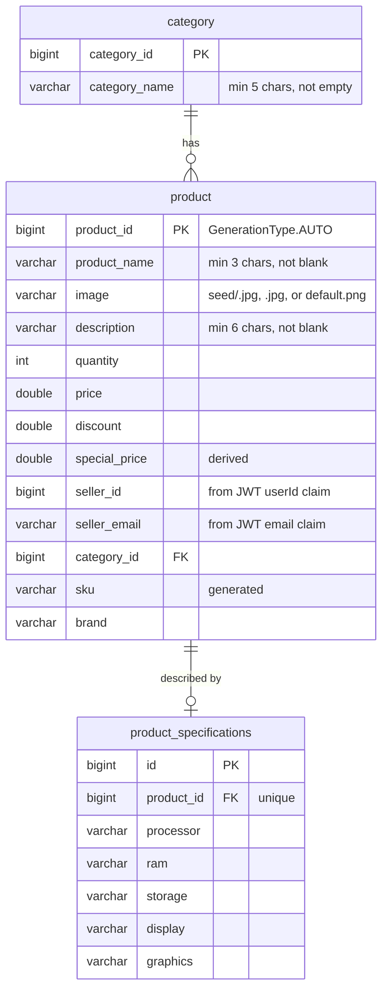

# Product Service — Architecture Documentation

**Module:** `backend/product-service`
**Port:** `8081` · **Gateway prefix:** `/product-manager/**`
**Database:** `ecommerce_product` (prod) / `laptop_ecommerce_graduation_project_product_service` (dev)
**Stack:** Spring Boot 3.5.7 · Spring Data JPA · Java 21

> **Note on naming.** This document was requested as "project-service". There is
> no `project-service` module in the repository; the catalogue service is
> `backend/product-service`, documented here.

---

## Table of Contents

1. [Service Overview](#1-service-overview)
2. [System Context](#2-system-context)
3. [Internal Layered Architecture](#3-internal-layered-architecture)
4. [Data Model](#4-data-model)
5. [REST API Reference](#5-rest-api-reference)
6. [Product Search and Filtering](#6-product-search-and-filtering)
7. [Internal API for Order Service](#7-internal-api-for-order-service)
8. [Image Upload and Serving](#8-image-upload-and-serving)
9. [SKU Generation and Pricing](#9-sku-generation-and-pricing)
10. [Authentication & Authorization](#10-authentication--authorization)
11. [Configuration](#11-configuration)
12. [Exception Handling](#12-exception-handling)
13. [Deployment & Dependencies](#13-deployment--dependencies)
14. [Design Notes & Known Trade-offs](#14-design-notes--known-trade-offs)
15. [Cross-References](#15-cross-references)

---

## 1. Service Overview

Product Service is the laptop catalogue: categories, products, technical
specifications, images, and the faceted search the storefront runs on. It is
also the authority on stock, which Order Service consults over a private
internal API.

### Responsibilities

| Responsibility | Entry point |
|---|---|
| Category CRUD | `CategoryController` |
| Product CRUD for admin and seller | `ProductController` |
| Public faceted search | `GET /api/public/products` |
| Brand facet values | `GET /api/public/products/brands` |
| Technical specifications | `ProductSpecificationController` |
| Product image upload and serving | `FileService` + `WebMvcConfig` |
| Stock lookup and decrement for Order Service | `/api/internal/**` |
| Product-count aggregate | `AnalyticsService` |

### What it does not do

- No messaging. It is the only business service with **no RabbitMQ dependency**.
- No knowledge of carts, orders, or users beyond the `sellerId` / `sellerEmail`
  stamped onto each product from the JWT.
- No stock reservation — only an immediate decrement.

---

## 2. System Context

```
   Browser (React SPA)                     Order Service :8083
          │                                        │
          ▼                                        │ RestTemplate
   API Gateway :8080                               │ product.service.base-url
   /product-manager/**                             │ (direct, no gateway,
          │                                        │  no Eureka)
          ▼                                        ▼
   ┌───────────────────────────────────────────────────────┐
   │ Product Service :8081                                 │
   │   CategoryController      /api/...                    │
   │   ProductController       /api/...                    │
   │   ProductSpecController   /api/products/...           │
   │   AuthUtil ← re-parses the JWT cookie                 │
   │   WebMvcConfig: /images/** → file:<project.image>     │
   └───────────────────────┬───────────────────────────────┘
                           ▼
                 MySQL ecommerce_product
```

### External Dependencies

| Dependency | Purpose | Failure behaviour |
|---|---|---|
| MySQL | Persistence | Startup fails |
| Config Server | All configuration | `optional:` import; no datasource → context fails |
| Discovery Service | Registers as `PRODUCT-SERVICE` | Gateway route unavailable until registered |
| Local filesystem | Product images under `project.image` | `IOException` propagates from upload |

Product Service calls no other service. Order Service calls **it**.

---

## 3. Internal Layered Architecture

```
com.ecommerce.product_service
├── ProductServiceApplication.java
├── config/
│   ├── AppConfig.java            # ModelMapper bean
│   ├── AppConstants.java         # pagination defaults
│   ├── SwaggerConfig.java        # OpenAPI metadata + bearer scheme
│   └── WebMvcConfig.java         # /images/** resource handler
├── controller/   CategoryController, ProductController, ProductSpecificationController
├── exceptions/   APIException, EmptyArrayException,
│                 ResourceNotFoundException, MyGlobalExceptionHandler
├── imageutil/ImagePathUtils.java # resolves project.image against the working dir
├── model/        Category, Product, ProductSpecification
├── payload/      DTOs (see §5)
├── repositories/ Category, Product (+JpaSpecificationExecutor), ProductSpecification
├── security/JwtService.java      # cookie → claims, incl. extractUserId
├── service/      Category, Product, ProductSpecification, File, Analytics (+Impl)
└── util/
    ├── AuthUtil.java             # request-scoped claims cache
    └── SKUGenerator.java         # CATEGORY-BRAND-MODEL-RANDOM
```

`SwaggerConfig` declares a **bearer** security scheme while the service actually
authenticates by cookie, so Swagger's Authorize button does not produce a working
request.

---

## 4. Data Model

### Entity-relationship diagram



Schema is generated by Hibernate (`ddl-auto: update`); there are no migrations.

### Tables

#### `category`

| Column | Notes |
|---|---|
| `category_id` | `IDENTITY` |
| `category_name` | `@Size(min = 5)`, `@NotEmpty` |

`@OneToMany(mappedBy = "category", cascade = CascadeType.ALL)` — see the deletion
note in [§14](#14-design-notes--known-trade-offs).

#### `product`

| Column | Notes |
|---|---|
| `product_id` | **`GenerationType.AUTO`** — unlike every other entity in the backend, which uses `IDENTITY`. On MySQL this makes Hibernate 6 allocate ids from a `product_seq` table rather than an auto-increment column |
| `special_price` | Computed as `price - (discount * 0.01) * price` on create and update |
| `seller_id` / `seller_email` | Stamped from the JWT at creation and never changed afterwards |
| `sku` | Generated, **not unique-constrained** |
| `brand` | Free text; the source of the brand facet |

`@OneToOne(mappedBy = "product", cascade = ALL, orphanRemoval = true)` to
`ProductSpecification`, so deleting a product deletes its specification row.

#### `product_specifications`

Five free-text columns — `processor`, `ram`, `storage`, `display`, `graphics` —
each holding a full human-readable string such as
`"Intel Core i7-13700H (up to 5.0GHz, 14 cores)"` or `"16GB DDR5 4800MHz"`.
`product_id` carries a unique constraint, enforcing one specification per product.

Storing specs as free text rather than normalized attributes is what forces the
`LIKE %value%` filtering described in [§6](#6-product-search-and-filtering).

### Repository queries

| Repository | Method | Notes |
|---|---|---|
| `ProductRepository` | extends `JpaSpecificationExecutor<Product>` | Powers the faceted search |
| | `findByCategory(Category, Pageable)` | Category browse |
| | `findByProductNameLikeIgnoreCase(String, Pageable)` | Keyword browse |
| | `findBySellerEmail(String, Pageable)` | Seller's own products |
| | `findAllDistinctBrands()` | `SELECT DISTINCT p.brand ... WHERE p.brand IS NOT NULL AND p.brand != '' ORDER BY p.brand` |
| | `findByCategoryOrderByPriceAsc`, `findByProductNameLikeIgnoreCase(String)` | **unused** |
| `CategoryRepository` | `findByCategoryName(String)` | Duplicate-name check |
| `ProductSpecificationRepository` | `findByProductProductId`, `deleteByProductProductId` | Nested-property derived queries |

---

## 5. REST API Reference

Paths are service-local. Prepend `/product-manager` for the gateway URL.

### Categories — `CategoryController` (`/api`)

| Method | Path | Success | Access at gateway |
|---|---|---|---|
| GET | `/public/categories` | 200 | public |
| POST | `/admin/categories` | 201 | `ROLE_ADMIN` |
| PUT | `/admin/categories/{categoryId}` | 200 | `ROLE_ADMIN` |
| DELETE | `/admin/categories/{categoryId}` | 200 | `ROLE_ADMIN` |

### Products — `ProductController` (`/api`)

| Method | Path | Success | Access at gateway |
|---|---|---|---|
| GET | `/public/products` | 200 | public |
| GET | `/public/products/brands` | 200 | public |
| GET | `/public/categories/{categoryId}/products` | 200 | public |
| GET | `/public/products/keyword/{keyword}` | **302 FOUND** | public |
| POST | `/admin/categories/{categoryId}/product` | 201 | `ROLE_ADMIN` |
| PUT | `/admin/products/{productId}` | 200 | `ROLE_ADMIN` |
| DELETE | `/admin/products/{productId}` | 200 | `ROLE_ADMIN` |
| PUT | `/admin/products/{productId}/image` | 200 | `ROLE_ADMIN` |
| GET | `/admin/products` | 200 | `ROLE_ADMIN` |
| GET | `/admin/app/analytics` | 200 | `ROLE_ADMIN` |
| POST | `/seller/categories/{categoryId}/product` | 201 | **authenticated only** |
| PUT | `/seller/products/{productId}` | 200 | **authenticated only** |
| DELETE | `/seller/products/{productId}` | 200 | **authenticated only** |
| PUT | `/seller/products/{productId}/image` | 200 | **authenticated only** |
| GET | `/seller/products` | 200 | **authenticated only** |
| GET | `/internal/products/{productId}` | 200 | **authenticated only** (see [§7](#7-internal-api-for-order-service)) |
| POST | `/internal/products/{productId}/reduce-stock` | 202 | **authenticated only** |

Each `/seller/...` method delegates to exactly the same service call as its
`/admin/...` twin. The distinction is naming only — the gateway now requires
`ROLE_SELLER` on `/product-manager/api/seller/**`, but the handlers themselves
never compare `product.sellerEmail` to the caller, so one seller can still edit
another seller's products (`SEC-05` in [../known-defects.md](../known-defects.md)).

### Specifications — `ProductSpecificationController` (`/api`)

| Method | Path | Success | Access at gateway |
|---|---|---|---|
| POST | `/api/admin/products/{productId}/specifications` | 200 | `ROLE_ADMIN` |
| POST | `/api/seller/products/{productId}/specifications` | 200 | `ROLE_SELLER` |
| GET | `/api/public/products/{productId}/specifications` | 200 | public |
| DELETE | `/api/admin/products/{productId}/specifications` | 204 | `ROLE_ADMIN` |
| DELETE | `/api/seller/products/{productId}/specifications` | 204 | `ROLE_SELLER` |

The controller's base path is `/api`, so the role segment (`admin`, `seller`,
`public`) is the *second* path segment — the position the gateway's patterns
match on. Until 2026-08-25 the base path was `/api/products`, which pushed that
segment to third position and made every pattern miss: writes carried no role
check, and the read endpoint was not public. See `SEC-06` in
[../known-defects.md](../known-defects.md).

Both handler pairs still call the same `createOrUpdateSpecification` /
`deleteSpecification` service methods, so the split is enforced entirely at the
gateway. Neither checks `product.sellerEmail` against the caller, so a seller can
still write specifications for another seller's product (`SEC-05`).

### Pagination

`AppConstants` defaults:

| Param | Default |
|---|---|
| `pageNumber` | `0` |
| `pageSize` | `6` |
| `sortBy` | `categoryId` (categories) / `productId` (products) |
| `sortOrder` | `asc` |

### DTOs

| DTO | Fields |
|---|---|
| `CategoryDTO` | `categoryId`, `categoryName` |
| `CategoryResponse` | `content`, `pageNumber`, `pageSize`, `totalElements`, `totalPages`, `lastPage` |
| `ProductDTO` | `productId`, `productName`, `image`, `description`, `quantity`, `price`, `discount`, `specialPrice`, `sellerId`, `sellerEmail`, `sku`, `brand` |
| `ProductResponse` | same page envelope as `CategoryResponse` |
| `ProductSpecificationDTO` | `processor`, `ram`, `storage`, `display`, `graphics` |
| `InventoryUpdateRequest` | `quantity` |
| `AnalyticsProductResponse` | `productCount` — a **string** |
| `APIResponse` | `message`, `status` — error envelope |

`ProductDTO.image` is rewritten on every read to an absolute URL
(`${image.base.url}/{filename}`); the database stores only the filename.

---

## 6. Product Search and Filtering

`GET /api/public/products` is the storefront's main query. It builds a JPA
`Specification<Product>` from whichever parameters are present.

| Param | Predicate |
|---|---|
| `keyword` | `LOWER(productName) LIKE %keyword%` |
| `category` | `LOWER(category.categoryName) LIKE category` — note: no `%` wrappers, so this is an exact case-insensitive match |
| `minPrice` | `specialPrice >= minPrice` |
| `maxPrice` | `specialPrice <= maxPrice` |
| `brands` | comma-separated → `brand IN (...)` — exact, case-sensitive |
| `processors` | comma-separated → `OR` of `LOWER(specification.processor) LIKE %v%` |
| `ram` | comma-separated → `OR` of `LOWER(specification.ram) LIKE %v%` |
| `storage` | comma-separated → `OR` of `LOWER(specification.storage) LIKE %v%` |

Predicates are combined with `AND`; values inside one facet are combined with
`OR` — the standard faceted-search semantics.

### Three behaviours to know

1. **`root.join("specification")` is an inner join.** Any `processors`, `ram`, or
   `storage` filter silently excludes every product that has no specification
   row. Using three facets at once produces three separate joins to the same
   table.
2. **Leading-wildcard `LIKE` cannot use an index.** Every spec facet is a full
   table scan of `product_specifications`. Normalizing RAM and storage into
   discrete columns (or a lookup table) is the structural fix.
3. **An empty result is an error.** When the page is empty the service throws
   `APIException("No Products Exist!!!")`, which the global handler turns into
   **400 Bad Request**. A search that legitimately matches nothing is
   indistinguishable from a malformed request. The same pattern appears in
   `searchByCategory` (`"<category> category does not have any products"`) and
   `searchProductByKeyword` (`"Product not found with keyword: ..."`), and in
   `CategoryServiceImpl.getAllCategories` (`"List is empty!!"`).

   `getAllProductsForAdmin` and `getAllProductsForSeller` do **not** do this —
   they return an empty page correctly. The behaviour is inconsistent across the
   service.

`GET /api/public/products/keyword/{keyword}` additionally returns **302 FOUND**
rather than 200, with a normal JSON body and no `Location` header.

---

## 7. Internal API for Order Service

Two endpoints exist solely for Order Service:

### `GET /api/internal/products/{productId}`

Returns a `ProductDTO` including `quantity` (available stock), `specialPrice`,
`sellerId`, and `sellerEmail`. Order Service copies these into the
`ProductSnapshot` it embeds in cart and order lines.

404 `ResourceNotFoundException` when the product is gone.

### `POST /api/internal/products/{productId}/reduce-stock`

```json
{ "quantity": 2 }
```

```java
if (quantity < 0)                      throw new APIException("Quantity must be positive");
if (product.getQuantity() < quantity)  throw new APIException("Insufficient product quantity");
product.setQuantity(product.getQuantity() - quantity);
```

Returns **202 Accepted** with an empty body, though the write is synchronous.

### How Order Service reaches it

`RestTemplateProductServiceClient` builds URLs from
`product.service.base-url` (`http://localhost:8081/api` in dev,
`http://product-service:8081/api` in prod) — **not** through the gateway and
**not** through Eureka. Consequently:

- The gateway's `/product-manager/api/internal/**` is not on its public-path
  list, and does not need to be.
- These endpoints carry no authentication of their own and rely entirely on the
  network boundary. If port 8081 is published to the host (as Compose does), any
  process on the host can decrement stock arbitrarily.

### Concurrency

The decrement is a read-modify-write with no optimistic locking (`@Version`) and
no `@Transactional` annotation on `reduceProductQuantity`. Two orders placed
simultaneously for the last unit can both read `quantity = 1` and both write
`quantity = 0`, overselling by one. A `@Version` column or an atomic
`UPDATE product SET quantity = quantity - :q WHERE product_id = :id AND quantity >= :q`
would close it.

There is also an NPE risk: `product.getQuantity() < quantity` unboxes a nullable
`Integer`, and `quantity` has no `@NotNull` on the entity.

---

## 8. Image Upload and Serving

### Upload

`PUT /api/{admin|seller}/products/{productId}/image` with a `multipart/form-data`
part named `image`.

`FileServiceImpl.uploadImage`:

```java
String fileName = UUID.randomUUID() + originalFileName.substring(originalFileName.lastIndexOf("."));
Files.createDirectories(configuredPath);
Files.copy(file.getInputStream(), configuredPath.resolve(fileName), REPLACE_EXISTING);
```

The random UUID prevents collisions and path traversal through the filename. But:

- There is **no content-type or extension allow-list** — any file type is
  accepted and stored.
- `originalFileName.lastIndexOf(".")` returns `-1` for a file with no extension,
  making `substring(-1)` throw `StringIndexOutOfBoundsException`, and
  `getOriginalFilename()` can be null, making the whole expression NPE. Both
  surface as an unhandled 500.
- The old image file is never deleted when a product's image is replaced or the
  product is removed, so the directory grows monotonically.

`spring.servlet.multipart.max-file-size` and `max-request-size` are both `50MB`.

### Path resolution — `ImagePathUtils`

`project.image` is `images/`, a relative path. `resolveConfiguredPath` resolves
it against the process working directory, with one special case: if the working
directory does not already end in `product-service` but contains a
`product-service/` subdirectory, that subdirectory is used as the base.

This is a convenience so `mvn spring-boot:run` works both from `backend/` and
from `backend/product-service/`. It also means the effective upload location
depends on where the process was started, which is worth remembering when
images "disappear" after a change in launch directory. In Docker the working
directory is `/app`, so images land in `/app/images` — **on the container
filesystem, with no volume mount**, so every uploaded image is lost when the
container is recreated.

### Serving

`WebMvcConfig` registers `/images/**` against the resolved directory as a
`file:` resource location. The gateway lists `/product-manager/images/**` as a
public path, so images load without a cookie.

`ProductServiceImpl.constructImageUrl` prefixes the stored filename with
`${image.base.url}`:

| Profile | `image.base.url` |
|---|---|
| `dev` | `http://localhost:8080/product-manager/images` |
| `prod` | `${IMAGE_BASE_URL:http://localhost:8080/product-manager/images}` |

Because the base URL points at the **gateway**, image URLs are correct for the
browser even though the files live on the Product Service container.

New products are created with `image = "default.png"`, which must exist in the
images directory or the storefront shows a broken image — no such file ships, so
it does not; that is [OPS-01](../known-defects.md).

Seeded products instead carry `seed/<slug>.jpg`. Those files are baked into the
container image by the `Dockerfile`, and the resource handler's `/images/**`
pattern matches the nested path, so they resolve without any upload.

---

## 9. SKU Generation and Pricing

### SKU

`SKUGenerator.generateSKU(categoryName, brand, productName)` produces
`CATEGORY-BRAND-MODEL-RANDOM`:

| Segment | Rule |
|---|---|
| Category | First 3 letters, uppercased, non-letters stripped, right-padded with `X` |
| Brand | Uppercased, non-alphanumerics stripped (whole string, no length cap) |
| Model | First alphanumeric word of ≥ 2 characters, truncated to 5 characters |
| Random | `String.format("%06d", random.nextInt(1_000_000))` |

Example: category `Gaming Laptops`, brand `Dell`, name `Dell XPS 13` →
`GAM-DELL-DELL-048213`.

It is regenerated on update when the product name or brand changes. There is no
unique constraint and no collision check — with a 6-digit random suffix, two
products in the same category and brand collide with probability ~1/1,000,000
per pair, which is small but not zero, and nothing would detect it.

The model segment takes the *first* qualifying word, which for `Dell XPS 13` is
`DELL` rather than `XPS` — so brand and model segments are often identical.

### Pricing

```java
specialPrice = price - (discount * 0.01) * price;
```

`discount` is a percentage. All money is `double`, both here and in Order
Service, so totals accumulate binary floating-point error. `BigDecimal` with an
explicit scale is the standard fix; it would have to change in both services and
in the `ProductSnapshot` at the same time.

`specialPrice` is stored, not derived at read time, so a discount change requires
going through `updateProduct` — writing `price` or `discount` directly in the
database leaves `special_price` stale, and it is `special_price` that both the
price filter and the cart use.

---

## 10. Authentication & Authorization

No Spring Security. Identity comes from re-parsing the gateway-validated cookie.

### `JwtService` (`security/`)

Identical to Order Service's, plus one method:

| Method | Behaviour |
|---|---|
| `resolveToken` | First `springBootEcom` cookie with a non-blank value |
| `isTokenValid` / `parseClaims` | HMAC verification via `Keys.hmacShaKeyFor(BASE64.decode(jwtSecret))` |
| `extractEmail` | `claims.get("email")` |
| `extractUserId` | `claims.get("userId")`, accepting a `Number` or a parseable string; returns null and logs a warning otherwise |
| `extractUsername` | `claims.getSubject()` |
| `extractRoles` | List or comma-separated string |

`extractUserId` exists because `addProduct` stamps `product.sellerId`.

### `AuthUtil`

Caches parsed claims on the request under `PRODUCT_SERVICE_JWT_CLAIMS`. Exposes
`loggedInEmail()` and `loggedInUserId()`, each throwing `APIException` when the
claim is absent.

`extractRoles` is never called. **All role enforcement is at the gateway.**

### Where the identity is actually used

| Use | Method |
|---|---|
| Stamp `sellerId` / `sellerEmail` on a new product | `addProduct` |
| Filter the seller's own products | `getAllProductsForSeller` |

That is the complete list. In particular:

- `updateProduct`, `deleteProduct`, and `updateProductImage` do **not** check
  that the caller is the product's seller. Combined with
  `/product-manager/api/seller/**` having no role mapping, **any authenticated
  user can edit or delete any product in the catalogue.**
- `createOrUpdateSpecification` and `deleteSpecification` have no ownership check
  either.

---

## 11. Configuration

### Local — `product-service/src/main/resources/application.yaml`

```yaml
spring:
  application: { name: product-service }
  profiles:    { active: ${SPRING_PROFILES_ACTIVE:dev} }
  config:      { import: optional:configserver:${CONFIG_SERVER_URL:http://localhost:8888} }
```

Four lines — everything else comes from Config Server.

### From Config Server — `config/product-service.yml`

| Key | Value |
|---|---|
| `spring.jpa.hibernate.ddl-auto` | `update` |
| `spring.app.jwtSecret` | shared HMAC secret |
| `spring.app.jwtExpirationMs` | `3000000` |
| `spring.ecom.app.jwtCookieName` | `springBootEcom` |
| `spring.servlet.multipart.max-file-size` | `50MB` |
| `spring.servlet.multipart.max-request-size` | `50MB` |
| `project.image` | `images/` |
| `server.port` | `8081` |
| `springdoc.api-docs.enabled` | `true` |

### Profile overrides

| Key | `-dev` | `-prod` |
|---|---|---|
| `spring.datasource.url` | `jdbc:mysql://localhost:3306/laptop_ecommerce_graduation_project_product_service?serverTimezone=UTC&createDatabaseIfNotExist=true` | `jdbc:mysql://mysql:3306/ecommerce_product?createDatabaseIfNotExist=true` |
| `spring.datasource.username` / `password` | `root` / `root` | `root` / `root` |
| `image.base.url` | `http://localhost:8080/product-manager/images` | `${IMAGE_BASE_URL:...}` |
| `frontend.url` | `http://localhost:5173` | `${FRONTEND_URL:...}` |
| Eureka zone | `http://localhost:8761/eureka/` | `http://discovery-service:8761/eureka/` |
| `eureka.instance.prefer-ip-address` | `true` | not set |
| `springdoc.api-docs.enabled` | inherits `true` | `false` |

There is deliberately **no** `spring.rabbitmq.*` block.

### Environment variables

| Variable | Default | Used for |
|---|---|---|
| `SPRING_PROFILES_ACTIVE` | `dev` | Profile selection |
| `CONFIG_SERVER_URL` | `http://localhost:8888` | Config Server address |
| `IMAGE_BASE_URL` | `http://localhost:8080/product-manager/images` | Absolute image URLs |
| `FRONTEND_URL` | `http://localhost:5173` | Declared but unused in code |

---

## 12. Exception Handling

`MyGlobalExceptionHandler` (`@RestControllerAdvice`):

| Exception | Status | Body |
|---|---|---|
| `MethodArgumentNotValidException` | 400 | `{ "<field>": "<message>" }` map |
| `ResourceNotFoundException` | 404 | `APIResponse{ message, status:false }` |
| `APIException` | 400 | `APIResponse{ message, status:false }` |

### Not handled

| Exception | Result |
|---|---|
| `IOException` from image upload | Default 500 |
| `StringIndexOutOfBoundsException` / NPE on a filename without an extension | Default 500 |
| `NullPointerException` on `product.getQuantity()` when stock is null | Default 500 |
| `EmptyArrayException` | Declared but never thrown or mapped |

Because `APIException` maps to 400, the empty-result-as-error pattern described
in [§6](#6-product-search-and-filtering) is what makes an ordinary "no matches"
search look like a client error.

---

## 13. Deployment & Dependencies

### Docker

Multi-stage build on `mcr.microsoft.com/openjdk/jdk:21-ubuntu`, exposing `8081`.

Under the `prod` compose profile it depends on `mysql`, `discovery-service`,
`config-server`, and `api-gateway` being healthy, and receives
`SPRING_PROFILES_ACTIVE`, `SPRING_CONFIG_IMPORT`, `CONFIG_SERVER_URL`,
`IMAGE_BASE_URL`, and `FRONTEND_URL`.

**No volume is mounted for `images/`.** Uploaded product images live only in the
container's writable layer and are lost on `docker compose down` or any image
rebuild.

### Maven dependencies

| Dependency | Version | Why |
|---|---|---|
| `spring-boot-starter-data-jpa` | 3.5.7 | Persistence and `JpaSpecificationExecutor` |
| `spring-boot-starter-web` | 3.5.7 | REST + multipart |
| `spring-boot-starter-validation` | 3.5.7 | `@NotBlank`, `@Size` on entities and DTOs |
| `spring-cloud-starter-config` | 2025.0.0 | Config Server client |
| `spring-cloud-starter-netflix-eureka-client` | 2025.0.0 | Registers as `PRODUCT-SERVICE` |
| `modelmapper` | 3.2.4 | Entity ↔ DTO |
| `springdoc-openapi-starter-webmvc-ui` | 2.8.13 | Swagger UI |
| `jjwt-api` / `-impl` / `-jackson` | **0.12.6** | Cookie JWT parsing |
| `mysql-connector-j` | managed | Driver |
| `lombok` | managed | `@Data` on entities and DTOs |

Note the jjwt version: **0.12.6** here versus **0.13.0** in the gateway, Order
Service, and User Service. All four verify the same tokens, so the versions must
stay signature-compatible; aligning them removes the risk.

### Tests

`ProductServiceApplicationTests` is a context-load smoke test only. Search
specifications, SKU generation, image upload, and stock reduction are untested.

---

## 14. Design Notes & Known Trade-offs

### 1. Seller endpoints are unprotected

`/product-manager/api/seller/**` matches no gateway role mapping, and no service
method verifies product ownership. Any authenticated customer can create,
update, delete, or re-image any product. Two independent fixes are needed: add
the gateway role mapping, and check `product.sellerEmail` against
`AuthUtil.loggedInEmail()` in `updateProduct`, `deleteProduct`, and
`updateProductImage`.

### 2. The specification controller sits outside the gateway's path scheme

Covered in [§5](#specifications--productspecificationcontroller-apiproducts). It
leaves write endpoints unchecked *and* makes the public read endpoint require a
login — a functional bug for anonymous shoppers.

### 3. Stock decrement is not concurrency-safe

Covered in [§7](#concurrency). Overselling under simultaneous checkout is
reachable with two concurrent requests.

### 4. Empty results are 400 errors

Covered in [§6](#three-behaviours-to-know). The frontend has to treat a specific
400 message as "no results", and the behaviour is inconsistent with the admin
and seller listings, which return empty pages properly.

### 5. Deleting a category deletes its products

`Category` → `Product` cascades `ALL`, so `DELETE /api/admin/categories/{id}`
removes every product in that category, and each product cascades to its
specification. Existing orders survive because they hold a `ProductSnapshot`
rather than a foreign key — the historical record is intact, but the catalogue
loss is silent and irreversible.

### 6. `updateCategory` rebuilds the entity from the DTO

```java
Category category = modelMapper.map(categoryDTO, Category.class);  // products == null
categoryRepository.findById(categoryId).orElseThrow(...);          // result discarded
category.setCategoryId(categoryId);
savedCategory = categoryRepository.save(category);
```

The loaded entity is fetched only to trigger the 404 and is then thrown away;
the saved instance is a fresh object carrying only the two DTO fields. Any
column added to `Category` in future would be silently nulled on every update.
Mutating the loaded entity instead is both safer and shorter.

### 7. `GenerationType.AUTO` on `Product` only

Every other entity in the backend uses `IDENTITY`. On MySQL with Hibernate 6,
`AUTO` selects a sequence-table strategy, so `product` ids come from a separate
allocation table rather than an auto-increment column. It works, but it is an
inconsistency that surprises anyone reading the schema, and it makes bulk
inserts behave differently from every other table.

### 8. Uploaded files are unvalidated and unmanaged

No MIME allow-list, no size check beyond the 50MB multipart cap, no cleanup of
replaced files, and no persistent volume. Files are served as static resources
so they are not executed, but an authenticated user can fill the container's
disk with arbitrary content.

### 9. Specifications are free text

`ram = "16GB DDR5 4800MHz"` cannot be filtered or sorted numerically, which is
why the facets use leading-wildcard `LIKE`. Splitting the value into a numeric
column plus a descriptive one would make the facet indexable and let the UI
offer real ranges.

### 10. `double` for money

Shared with Order Service through `ProductSnapshot`. Rounding error is small per
item and accumulates across an order's lines.

### 11. Dead code

`EmptyArrayException`, `ProductRepository.findByCategoryOrderByPriceAsc`, the
non-paginated `findByProductNameLikeIgnoreCase`, and
`CategoryServiceImpl.nextId` are unreferenced.

---

## 15. Cross-References

| Topic | Document |
|---|---|
| The consumer of `/api/internal/**` | [order-service.md](order-service.md#7-order-placement-flow) |
| Why `ProductSnapshot` instead of a foreign key | [../../architecture/decisions/0007-embedded-product-snapshot.md](../../architecture/decisions/0007-embedded-product-snapshot.md) |
| Gateway role mappings and their gaps | [api-gateway.md](api-gateway.md#role-mappings) |
| JWT claims (`email`, `userId`, `roles`) | [../../architecture/security-model.md](../../architecture/security-model.md#claims) |
| Config keys and profile overrides | [config-server.md](config-server.md#product-serviceyml-shared) |
| Full endpoint listing | [../api-reference.md](../api-reference.md#product-service--product-manager) |
| Services and ports | [../../architecture/system-overview.md](../../architecture/system-overview.md) |
| Startup and env vars | [../../operations/running-locally.md](../../operations/running-locally.md) |
