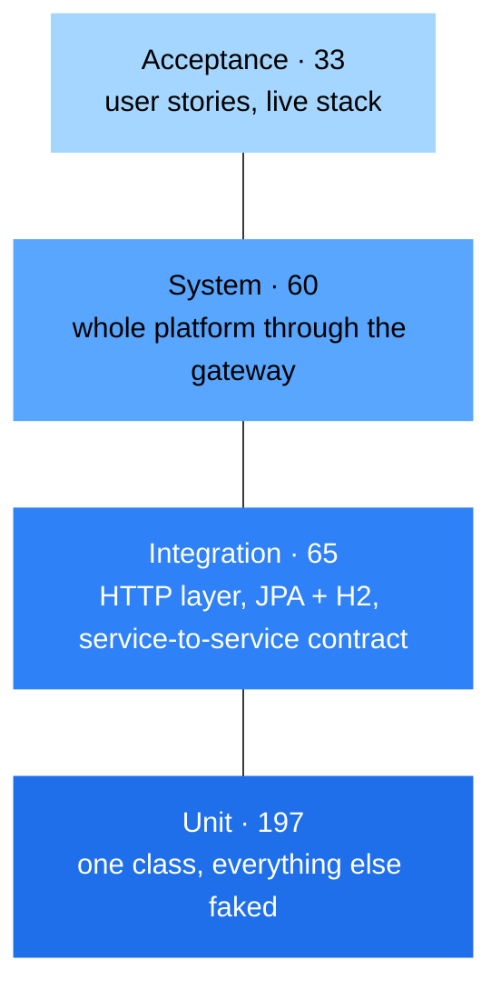

# Test Plan

How the TechZone platform is tested: at four levels, with what, to what
standard, and when a change or a release is allowed through.

**The short version.** **197 unit tests** and **65 integration tests** run
offline with no infrastructure at all — no fixture database, no SMTP host, no
Stripe key, no Config Server. **60 system tests** and **33 acceptance tests** run
against a live stack through the API Gateway. With 7 context-load smoke tests,
**362 automated tests** in total.

The concrete cases are in [test-cases.md](test-cases.md); the manual pass is
[uat-checklist.md](uat-checklist.md); what has been executed and what it found is
in [test-report.md](test-report.md).

---

## Table of Contents

1. [Objectives](#1-objectives)
2. [Scope](#2-scope)
3. [The Four Levels](#3-the-four-levels)
4. [Where the Tests Live](#4-where-the-tests-live)
5. [Level 1 — Unit](#5-level-1--unit)
6. [Level 2 — Integration](#6-level-2--integration)
7. [Level 3 — System](#7-level-3--system)
8. [Level 4 — Acceptance](#8-level-4--acceptance)
9. [Environments, Test Data and Isolation](#9-environments-test-data-and-isolation)
10. [Tooling and Conventions](#10-tooling-and-conventions)
11. [Running Everything](#11-running-everything)
12. [Entry and Exit Criteria](#12-entry-and-exit-criteria)
13. [Risk-Based Priorities](#13-risk-based-priorities)
14. [Characterisation Tests](#14-characterisation-tests)
15. [Defect Handling](#15-defect-handling)
16. [What Is Deliberately Not Covered](#16-what-is-deliberately-not-covered)
17. [Cross-References](#17-cross-references)

---

## 1. Objectives

1. **Protect the purchase path.** Browse → cart → checkout → order is the only
   flow whose failure makes the platform worthless. It gets the deepest cover.
2. **Pin the contracts.** Each service's HTTP surface and each cross-service call
   is asserted, so a change that breaks a consumer fails a build rather than a
   demonstration.
3. **Make the security model checkable.** Role enforcement is gateway
   *configuration* — exactly what a compiler cannot check — so it is asserted
   both as written and as deployed.
4. **Record real behaviour, including the wrong kind.** Where a known defect
   makes the system deviate from its specification, a test asserts what it
   actually does and names the defect. See [§14](#14-characterisation-tests).
5. **Keep every level runnable by anyone.** No paid services, no shared
   database, no manual fixture setup, and nothing to `npm install`.

---

## 2. Scope

**In scope.** All seven backend services; the gateway's authentication and
routing rules; the cross-service REST contract between order-service and
product-service; the persistence layer against a real SQL engine; the SPA's
reducers and formatting helpers; and the platform end to end through the
gateway.

**Covered manually, not by automation.** Layout, wording, keyboard navigation,
the Stripe payment form and the arrival of a confirmation email —
[uat-checklist.md](uat-checklist.md).

**Not tested at all.** Third-party behaviour (Stripe's API, Gmail's SMTP, MySQL,
RabbitMQ), and the requirements listed as out of scope in
[../requirements/srs.md](../requirements/srs.md#10-out-of-scope).

---

## 3. The Four Levels

| Level | Question it answers | Scope of one test | Infrastructure | Count |
|---|---|---|---|---|
| **Unit** | Does this function do its own job? | One class or function, every collaborator faked | None | **197** |
| **Integration** | Do these parts still fit together? | A slice: HTTP layer + serialisation, repository + Hibernate + SQL, or a client + a real HTTP conversation | In-memory H2, an in-process HTTP stub | **65** |
| **System** | Does the assembled platform behave correctly? | The whole deployment, entered only through the gateway | The running stack | **60** (54 default, 6 opt-in) |
| **Acceptance** | Does it do what was promised to the user? | A user story, start to finish, in business language | The running stack | **33** (31 default, 2 opt-in) |

A further **7 context-load smoke tests** — one per backend module — prove each
Spring context still starts. They cost nothing and catch broken bean wiring
before another test fails confusingly.



The pyramid is deliberate. A bug in the special-price formula should be caught by
a millisecond-long unit test, not by a five-minute checkout run. The higher
levels exist to catch what the lower ones structurally cannot: a wrong URL, a
missing role mapping, a serialisation mismatch between two services, a promise to
the user that no single class is responsible for keeping.

**Everything below System must run on a laptop with nothing started, in one
`mvn test`.** That is what makes it usable in a pre-commit loop.

### Beside the pyramid: performance

All four levels ask *does it do the right thing*, one request at a time. A
fifth kind of testing asks *for how many people at once, and what gives way
first*: two JMeter plans in [`tests/load/`](../../tests/load/README.md), run at
smoke, load, stress and spike stages against a live stack with Prometheus and
Grafana watching from the inside. It is not part of the pyramid because it is
not pass/fail in the same way — a run produces numbers to judge against
thresholds, and names the resource that saturated. The plan, the thresholds
and the recorded runs are in
[performance-testing.md](performance-testing.md).

---

## 4. Where the Tests Live

```
backend/<service>/src/test/java/.../unit/           JUnit 5 + Mockito           — level 1
backend/<service>/src/test/java/.../integration/    Spring Boot test slices     — level 2
backend/<service>/src/test/resources/application.*  offline test configuration
tests/frontend/                                     node:test                   — level 1
tests/system/                                       node:test, live stack       — level 3
tests/acceptance/                                   node:test, live stack       — level 4
tests/acceptance/features/                          Gherkin, the promises in prose
tests/load/                                         JMeter, live stack          — performance
```

Backend tests sit inside the submodule they test, so `mvn test` in any module
runs everything that module owns. Everything that spans services — or that
belongs to the front end, which has no test runner installed — lives in
[`tests/`](../../tests) in the superproject, with its own
[README](../../tests/README.md).

The per-class inventory is in
[test-report.md](test-report.md#3-suite-inventory).

---

## 5. Level 1 — Unit

**Definition.** The smallest testable pieces — a function, a method, a reducer —
exercised in isolation. Every collaborator is a test double, so a failure points
at exactly one class.

**Tools.** JUnit 5, Mockito and AssertJ on the backend, all from
`spring-boot-starter-test` and already on every module. Node's built-in test
runner on the front end — no npm dependency was added, and none is needed.

**What it owns.** Business rules with no I/O: cart stock arithmetic,
special-price derivation, SKU composition, JWT claim extraction and validity,
image-path resolution, password verification, role defaulting, reducer
transitions, money formatting. A unit test that needs a database is misplaced.

Two are worth calling out. The **gateway filter** is the single point where the
platform decides whether a request is allowed through, so its truth table is
written out case by case rather than sampled. The **front-end reducers** import
straight out of the frontend submodule — they have no imports of their own, so
Node loads them as plain ES modules, which is how the SPA gets real unit tests
without adding Vitest, jsdom or Testing Library to its `package.json`.

---

## 6. Level 2 — Integration

**Definition.** Two or more real parts, connected. Nothing is faked below the
seam being tested.

**Tools.** Spring Boot test slices (`@WebMvcTest`, `@DataJpaTest`), in-memory
**H2**, `MockRestServiceServer` for the service-to-service contract, and
Spring's `Binder` for configuration.

**The seams covered:**

| Seam | What it proves |
|---|---|
| Controller → HTTP | URL mapping, query-parameter defaulting, JSON shape, and the `@RestControllerAdvice` that turns domain exceptions into 400/404 |
| Repository → Hibernate → SQL | Derived queries, hand-written JPQL, paging, cascades, and a `Specification` filter as real SQL |
| order-service → product-service | URL assembly, base-URL normalisation, deserialisation, the reduce-stock body shape, and how remote failures surface |
| Security filter chain | The real `SecurityConfig`, bean validation on sign-up, and the `Set-Cookie` header carrying the session |
| The deployed gateway policy | The shipped `application.yaml`, bound and asserted: no admin route on the public list, every mapping names a role |

That last one closes a loop the others cannot. The filter unit test proves the
filter enforces whatever policy it is handed; the policy test proves the policy
actually shipped is the one
[security-model.md](../architecture/security-model.md) documents. Neither alone
would catch a route quietly moved onto the public list.

This level is also where the platform's most characteristic defect class gets
caught: a handler that works but answers with the wrong status
(`BUG-04`, `BUG-12`).

### Making the suite run offline

Services normally read configuration from Config Server and register with
Eureka. Neither is available in CI, so each module carries a test-only
configuration file that shadows the deployed one on the test classpath:

```
backend/product-service/src/test/resources/application.yaml
backend/order-service/src/test/resources/application.yaml
backend/user-service/src/test/resources/application.yaml
backend/notification-service/src/test/resources/application.yml
```

Each disables Config Server and Eureka, points the datasource at in-memory H2
with `ddl-auto: create-drop`, and supplies throw-away values for the properties
the beans require. The JWT secret in those files signs tokens that exist only
inside a test run; mail and Stripe settings are placeholders that are never
contacted. **No real secret appears in any test file.**

Two details that are easy to trip over, documented in the files themselves:

- user-service maps its entity to a table called `user`, which H2 treats as a
  keyword — hence `NON_KEYWORDS=USER` on the connection URL, and
  `@AutoConfigureTestDatabase(replace = NONE)` on the repository test so the
  configured URL is actually used.
- notification-service sets `spring.cloud.config.fail-fast` in production, which
  would fail every test without a Config Server; the test file turns it off.

---

## 7. Level 3 — System

**Definition.** The complete, assembled platform, checked against its
requirements. Every request travels gateway → Eureka lookup → service →
database, and back. Nothing is stubbed.

**Tool.** Node's built-in test runner with `fetch`, in
[`tests/system/`](../../tests/system). A small `Session` helper keeps cookies the
way a browser does, so the tests exercise the real cookie-based authentication
path rather than a bearer-token shortcut.

**What it owns** — properties no single service can prove:

- All three services registered and reachable under their documented prefixes;
  path rewriting; CORS pre-flight from the SPA origin; an unknown prefix 404s.
- The access matrix **as deployed**: anonymous, customer, seller and
  administrator against public, cart, seller and admin routes; a rubbish cookie
  refused; signing out closing access again.
- Catalogue reads: page envelope, discount arithmetic holding across the whole
  catalogue, sorting, price and brand filters, keyword search, and that the
  image URL each product advertises is a path the gateway really serves an
  image from — which is what proves the seed photos shipped in the
  product-service container image and that `/images/**` stayed public.
- The path the architecture is built around: cart → cross-service stock check →
  order → cross-service stock decrement → order history, plus stock refusals and
  cart isolation between customers.

**Behaviour when the stack is down.** Each suite probes the gateway once before
it starts. If nothing answers, the whole suite is *skipped* with a single line
naming the command that starts the stack. A red result therefore always means
something is broken — never that something was not started.

---

## 8. Level 4 — Acceptance

**Definition.** Confirmation that the system does what was promised to the people
who will use it. Same running platform as level 3, but organised and worded as
user stories rather than endpoints.

Each feature is written twice, on purpose:

- **[`tests/acceptance/features/*.feature`](../../tests/acceptance/features)** —
  Gherkin. `Feature / As a / I want / So that`, then `Given / When / Then` in
  plain business language. This is the readable statement of what the platform
  promises, and the artefact to review with a supervisor or stakeholder.
- **`tests/acceptance/*.test.js`** — the same scenarios, executable, one test per
  scenario, with the `Given/When/Then` steps as comments in the same wording.

| Feature file | Executed by | Scenarios |
|---|---|---|
| `browsing-the-shop.feature` | `shopping.test.js` | 7 |
| `account-and-sign-in.feature` | `account.test.js` | 8 |
| `cart-and-order.feature` | `shopping.test.js` | 8 |
| `staff-boundaries.feature` | `staff.test.js` | 9 |

```gherkin
Scenario: The shop will not sell more units than it has
  When the customer tries to buy more units than the shop holds
  Then the shop refuses and says how many are available
  And nothing is added to the cart
```

Two scenarios in `staff-boundaries.feature` are marked **KNOWN GAP**: they
describe protections the platform does not yet have (`SEC-01`, self-granted
`ROLE_ADMIN`; `SEC-07`, any shopper listing every cart). They are written as
acceptance criteria because that is what they are, and the executable tests
record the current answer while naming the defect — so the gap is visible in the
suite rather than absent from it.

Stories and their acceptance criteria are in
[../requirements/user-stories.md](../requirements/user-stories.md).

---

## 9. Environments, Test Data and Isolation

| Environment | What it is | Used by |
|---|---|---|
| **Isolated JVM / Node** | No external process at all | Unit, all integration levels, front-end unit |
| **Local stack** | `docker compose up` with the `prod` profile, seeded catalogue for most scenarios | System, acceptance, manual |
| **Hybrid** | Infrastructure in Docker, services from the IDE | Debugging a failing system test |

| Level | Where its data comes from | How it is cleaned up |
|---|---|---|
| Unit | Built in the test method | Nothing to clean — no I/O happens |
| Integration | Seeded in `@BeforeEach` into H2 | Schema is `create-drop`; each test runs in a rolled-back transaction |
| System | The seeded demo accounts and catalogue | Cart changes undone in an `after` hook; order placement is opt-in |
| Acceptance | Registration scenarios invent a throw-away username per run | Throw-away accounts are left behind by design — evidence of the run, and they never collide with the seeded accounts |

Anything that writes an irreversible row — placing an order permanently
decrements stock — sits behind `RUN_DESTRUCTIVE=1`, off by default, so the
suites are safe to point at a shared environment.

**Credentials.** The defaults are the development demo accounts from
[../operations/running-locally.md](../operations/running-locally.md#seeded-users),
overridable per environment. No production secret is present in any test file.

---

## 10. Tooling and Conventions

| Concern | Choice |
|---|---|
| Java test runner | JUnit 5 (Jupiter), from `spring-boot-starter-test` |
| Mocking | Mockito, `@ExtendWith(MockitoExtension.class)` |
| Web layer | `MockMvc` for servlet services, `WebTestClient` for the WebFlux gateway |
| Persistence | H2 in `MODE=MySQL`, `ddl-auto: create-drop` |
| REST stubs | `MockRestServiceServer` against the service's own `RestTemplate` |
| System, acceptance, front-end unit | Node's built-in test runner and `fetch` — zero dependencies |
| Acceptance scenarios | Gherkin `.feature` files beside the tests |
| Frontend lint | ESLint (`npm run lint`) — static checks the unit suite cannot make |

### Naming and structure

- One test class per production class: `<Class>Test` for unit,
  `<Class>IntegrationTest` for integration.
- `@DisplayName` on every class and every test, written as a **sentence about
  behaviour** — "refuses a quantity larger than the stock on hand", not
  "testAddProductToCart2". The suite output is meant to read as a specification.
- `@Nested` classes group by the method or scenario under test.
- A test documenting a defect starts its display name with the defect id and the
  word *characterisation*.

### The rule that keeps the suites honest

**A test asserts behaviour, never implementation.** If a test has to change
because a method was renamed or a field moved, it was testing the wrong thing. If
it has to change because the system now answers `200` where it answered `400`,
that is exactly what it is for.

---

## 11. Running Everything

**Backend — no infrastructure needed:**

```bash
# one module
mvn -f backend/product-service/pom.xml test

# every module
for m in api-gateway config-server discovery-service notification-service \
         order-service product-service user-service; do
  mvn -f "backend/$m/pom.xml" test || break
done
```

**Front-end unit tests — no infrastructure needed:**

```bash
cd tests && npm run test:frontend
```

**System and acceptance — a running stack:**

```bash
# from the repository root, with a demo catalogue
COMPOSE_PROFILES=prod,seed docker compose up -d

cd tests
npm run preflight          # is the stack up?
npm run test:system
npm run test:acceptance
RUN_DESTRUCTIVE=1 npm test # also place a real order
```

Both end-to-end scripts pass `--test-concurrency=1`. That is not a performance
choice: the suites share the seeded demo accounts, and running two against the
same account at once trips `BUG-21` and permanently corrupts that account's cart.
Run them serially, or give each suite its own account through the environment
variables in [`tests/README.md`](../../tests/README.md).

**Rebuild before you trust a live run.** The Compose stack runs whatever is in
the images. On this suite's first live run the gateway image was three days older
than the repository and lacked the `ROLE_SELLER` mapping — the tests failed
correctly. `docker compose build` the services you have changed before concluding
that a failure is a code defect.

Everything the suites need is configurable from the environment — gateway URL,
cookie name, account credentials, timeouts.

---

## 12. Entry and Exit Criteria

### Before a change is written

- The requirement it serves exists in
  [../requirements/srs.md](../requirements/srs.md), or is added there first.
- The behaviour it changes has a test, or one is written first if the area is
  covered at all.

### Before a change is committed

| # | Criterion |
|---|---|
| 1 | Every affected module's `mvn test` passes |
| 2 | New or changed behaviour has a test at the lowest level that can prove it |
| 3 | A fixed defect has its characterisation test **inverted**, not deleted, and the register entry updated |
| 4 | `npm run lint` passes for a frontend change |
| 5 | The documents in `docs/` affected by the change are updated in the same change set |
| 6 | A session entry is added to [../dev-log/](../dev-log/) |

### Before a release is tagged

| # | Criterion |
|---|---|
| 1 | All automated suites pass, including system and acceptance against a freshly built stack |
| 2 | The [UAT checklist](uat-checklist.md) has been walked once and signed off |
| 3 | No open defect of **Critical** severity in [../backend/known-defects.md](../backend/known-defects.md) |
| 4 | [test-report.md](test-report.md) is regenerated and records the run |
| 5 | `CHANGELOG.md` moves the `[Unreleased]` entries into the version section |

Criterion 3 is currently unmet: the register holds open Critical entries. Until
they close, the platform is a demonstrable system, not a deployable one.

---

## 13. Risk-Based Priorities

Where to spend the next hour of testing, worst-first. Risk is
`likelihood × cost of being wrong`, judged from the defect distribution in
[bug-taxonomy.md](bug-taxonomy.md).

| Rank | Area | Why it ranks here | Level that should cover it |
|---|---|---|---|
| 1 | **Authorisation** — role and ownership | Enforcement is URL-pattern configuration, so a routing change silently opens an endpoint. Six register entries are exactly this | System (deployed policy), integration (ownership) |
| 2 | **Order placement** | Touches two databases, an external payment provider and a broker, with no transaction spanning them | Unit + cross-service integration + acceptance |
| 3 | **Stock arithmetic** | Money-adjacent, concurrent, and guarded only in application code | Unit, plus a concurrency harness that does not yet exist |
| 4 | **Cart integrity** | Two code paths compute the total differently (`BUG-07`), and concurrent adds corrupt the cart permanently (`BUG-21`) | Unit, plus a controlled concurrent test |
| 5 | **Search and filtering** | The most-used read path, and three register entries live in it | Persistence integration |
| 6 | **Cross-service contract** | A silent shape change breaks checkout only at run time | Cross-service integration |
| 7 | **Configuration** | A wrong profile or missing key fails the stack at boot, not in a test | Manual, plus Compose health checks |

---

## 14. Characterisation Tests

The platform ships with a register of verified defects. A suite written as if
they did not exist would fail everywhere and be switched off within a day; a
suite that quietly asserts the buggy behaviour as if it were correct is worse,
because it makes the bug permanent.

The convention that resolves this:

```java
@Test
@DisplayName("BUG-12 characterisation: keyword search answers 302 FOUND for a successful read")
void keywordSearchAnswers302() throws Exception {
    // Asserts 302, which is wrong. When BUG-12 is fixed this test MUST fail,
    // and the fix includes changing it to expect 200.
}
```

Three rules follow:

1. The display name carries the defect id and the word **characterisation**, so
   the suite output reads as a list of known deviations.
2. The assertion pins the *actual* behaviour, so the test fails the moment the
   defect is fixed — which is the notification that the register entry needs
   closing.
3. Fixing a defect means **inverting** its characterisation test in the same
   change set. Deleting it loses the coverage the defect bought.

**Why not assert the correct behaviour and let the suite go red?** Because a
permanently red suite is an ignored suite. Pinning real behaviour keeps every
failure meaningful today, and turns each fix into a test that has to be
consciously updated — exactly the review moment a fix deserves.

Which test pins which defect is tabulated in
[test-report.md](test-report.md#6-known-wrong-behaviour-under-test). The count
should fall to zero as the register closes; a rise means a new defect was
accepted rather than fixed.

---

## 15. Defect Handling

1. A failing test that is not a characterisation test is a regression: fix the
   code, not the test.
2. A newly found defect gets an entry in
   [../backend/known-defects.md](../backend/known-defects.md) with severity,
   reproduction and proposed fix, and a class in
   [bug-taxonomy.md](bug-taxonomy.md).
3. If it will not be fixed immediately, it gets a characterisation test in the
   same change set, so it cannot be forgotten and cannot silently worsen.
4. Severity drives urgency: **Critical** blocks a release, **High** blocks the
   affected feature's next change, **Medium** and below are scheduled.

Three defects — `BUG-19`, `BUG-20` and `BUG-21` — were found by writing and
running these suites rather than by reading the source, which is the strongest
available argument for the levels above the unit tier. Their stories are in
[test-report.md](test-report.md#7-what-the-suites-found-on-their-own).

---

## 16. What Is Deliberately Not Covered

Stated plainly, so nobody mistakes a gap for a guarantee.

- **React component rendering.** Reducers and helpers are unit-tested; components
  are not. Doing so means adding Vitest, jsdom and Testing Library to
  [`frontend/package.json`](../../frontend/package.json). Worth doing; not done.
- **Browser-level acceptance.** The acceptance suite drives the API, not the
  interface. The interface is covered by the manual
  [UAT checklist](uat-checklist.md); a Playwright suite is the natural next step.
- **Stripe.** No test contacts Stripe. `StripeServiceImpl` is exercised only
  through the order flow with a placeholder key; the payment form is a manual
  check.
- **Real SMTP.** `JavaMailSender` is always a test double. Whether a message
  actually arrives is a manual check.
- **RabbitMQ end to end.** Publishing is verified with a test double; that a
  message is consumed and turned into an email is not automated. A
  `RabbitMQContainer` under Testcontainers would close this.
- **Soak, volume, and everything above 20 concurrent users.** Load testing
  itself is no longer a gap: the JMeter plans in
  [`tests/load/`](../../tests/load/README.md) ran against the full stack on
  2026-08-29 and are recorded in
  [performance-testing.md](performance-testing.md). What that run did *not*
  do is find a limit — nothing saturated — so the stress and spike stages are
  still outstanding. Nothing runs for hours either, so a slow leak would go
  unnoticed, and the seeded catalogue (14 products) is far too small for the
  defects that only bite at thousands of rows — `BUG-17`'s in-memory paging
  among them, and `NFR-PRF-1`, which asks for a thousand.
- **Concurrency.** `BUG-02` (concurrent checkout overselling the last unit) and
  `BUG-21` (concurrent adds permanently breaking a cart) are both documented but
  neither is reproduced by a test. Doing so reliably needs a controlled
  multi-threaded harness, and in `BUG-21`'s case every successful reproduction
  leaves a corrupted row to be cleaned up in SQL. The end-to-end suites therefore
  run with `--test-concurrency=1` — a deliberate trade: they stop *stumbling*
  into `BUG-21` on every run, at the cost of no longer testing for it.
- **Schema migration.** `ddl-auto: update` leaves nothing to test. Flyway or
  Liquibase would have to come first.

---

## 17. Cross-References

| Question | Document |
|---|---|
| Which cases exist, and what do they verify? | [test-cases.md](test-cases.md) |
| What was executed, and what did it find? | [test-report.md](test-report.md) |
| What does a manual acceptance pass cover? | [uat-checklist.md](uat-checklist.md) |
| What defects are known, and how severe? | [../backend/known-defects.md](../backend/known-defects.md) |
| What *kinds* of defect does this codebase produce? | [bug-taxonomy.md](bug-taxonomy.md) |
| What is the system supposed to do? | [../requirements/srs.md](../requirements/srs.md) |
| How do I start the stack these suites need? | [../operations/running-locally.md](../operations/running-locally.md) |
| Which endpoint is which? | [../backend/api-reference.md](../backend/api-reference.md) |
| Who is allowed to call what? | [../architecture/security-model.md](../architecture/security-model.md) |
| How do I run the end-to-end suites? | [`tests/README.md`](../../tests/README.md) |
| How does it behave under concurrent load? | [performance-testing.md](performance-testing.md), [`tests/load/README.md`](../../tests/load/README.md) |
| What is being measured while it runs? | [../operations/observability.md](../operations/observability.md) |
